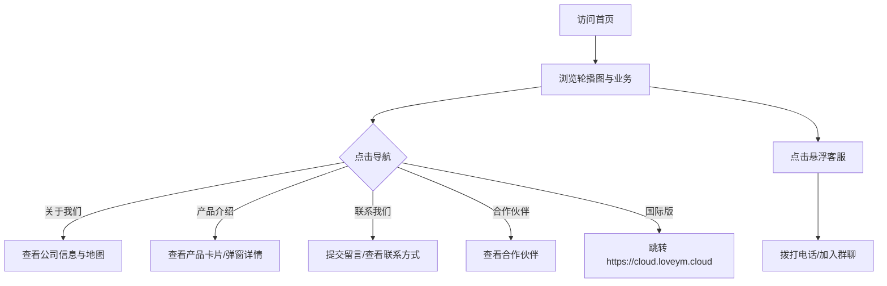
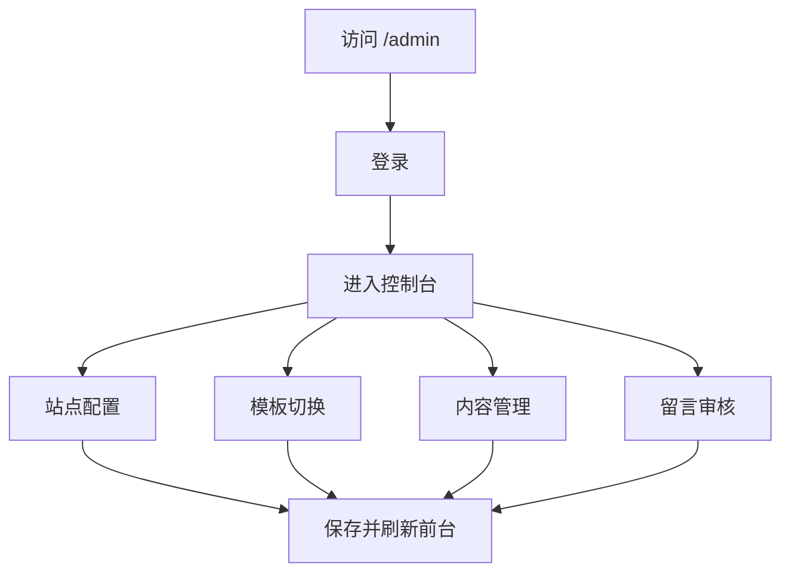

# 语云科技中国企业官网 - 产品需求文档（PRD）

## 1. 产品概述

语云科技（YuYun Technology）中国企业官网是一个面向国内用户的企业级展示与品牌宣传站点，融合魔方财务、腾讯云、Cloudflare 等主流云服务商的成熟设计范式，提供可配置的多模板、多页面企业门户与后台管理系统。

- 目标用户：国内企业客户、合作伙伴、终端消费者
- 部署环境：仅支持 HTML、PHP、CSS、JS 的普通虚拟主机
- 数据存储：优先使用 SQLite（虚拟主机常见扩展），可选 MySQL，离线环境可降级为 JSON 文件

## 2. 核心功能

### 2.1 用户角色

| 角色 | 进入方式 | 核心权限 |
|------|----------|----------|
| 访客 | 直接访问前台 | 浏览首页、关于我们、产品介绍、联系我们、合作伙伴、国际版跳转 |
| 管理员 | `/admin` + 账号密码 | 配置站点信息、轮播图、证书、备案号、合作伙伴、友情链接、模板切换、用户留言 |

### 2.2 功能模块

1. **前台首页**：顶部导航、轮播图、企业业务/产品展示、证书资质、合作伙伴横向滚动、全球公司分布地图、页脚
2. **关于我们**：公司名称、地址、介绍、地图、营销电话、官方群聊
3. **公司简介**：企业历程、企业文化、团队/荣誉
4. **产品介绍**：产品/服务卡片列表、详情弹窗
5. **联系我们**：联系表单、联系方式、地图、留言列表（后台审核后展示）
6. **合作伙伴**：合作伙伴 LOGO 墙与横向滚动
7. **国际版官网**：点击跳转 `https://cloud.loveym.cloud`
8. **后台管理**：登录、站点配置、模板切换、轮播图管理、产品/服务管理、合作伙伴管理、友情链接、证书管理、备案信息、用户留言、缓存/备份

### 2.3 页面详情

| 页面名称 | 模块名称 | 功能描述 |
|----------|----------|----------|
| 首页 | 顶部导航 | 企业 LOGO、主导航、右侧联系方式入口、移动端汉堡菜单 |
| 首页 | 轮播图 | 魔方/腾讯同款全屏轮播，支持标题、副标题、按钮、背景图配置 |
| 首页 | 业务/产品展示 | 魔方财务同款产品卡片，悬停上浮、弹窗详情 |
| 首页 | 证书资质 | 营业执照、电子增值电信业务许可证等图片展示 |
| 首页 | 合作伙伴 | 横版无限滚动展示合作伙伴 LOGO/名称 |
| 首页 | 公司分布地图 | 标注中东、欧洲、中国（北京/青岛）、俄罗斯（莫斯科/圣彼得堡）、韩国首尔、东南亚新加坡、澳大利亚、美国（纽约/华盛顿/旧金山） |
| 首页 | 悬浮客服 | 右侧固定联系方式、客服按钮（魔方同款） |
| 首页 | 弹窗提示 | Cloudflare/魔方同款公告弹窗、营销弹窗 |
| 关于我们 | 企业信息 | 公司名称、地址、介绍、营销电话、官方群聊入口 |
| 关于我们 | 地图 | 嵌入百度/高德/腾讯地图（后台可配置密钥与坐标） |
| 公司简介 | 企业介绍 | 文字、图片、历程时间线 |
| 产品介绍 | 产品列表 | 卡片式产品展示，点击弹出详情 |
| 联系我们 | 联系表单 | 姓名、电话、邮箱、留言内容，提交后进入后台审核 |
| 联系我们 | 联系方式 | 电话、邮箱、地址 |
| 合作伙伴 | 伙伴展示 | 网格/横向滚动 LOGO 墙 |
| 国际版 | 跳转 | 点击跳转国际版官网 |
| 后台 | 登录 | 管理员登录 |
| 后台 | 站点配置 | LOGO、标题、关键词、描述、联系方式、备案号、版权、地图配置等 |
| 后台 | 模板切换 | 多模板选择（默认企业蓝、科技黑、云白） |
| 后台 | 轮播图管理 | 增删改查、排序、启用/禁用 |
| 后台 | 产品/服务管理 | 图标、标题、简介、详情、排序 |
| 后台 | 合作伙伴管理 | LOGO、名称、链接、排序 |
| 后台 | 友情链接 | 名称、链接、排序 |
| 后台 | 证书管理 | 证书图片、名称、描述 |
| 后台 | 留言管理 | 查看、审核、删除 |
| 后台 | 备份/恢复 | 数据库/JSON 备份下载与恢复 |

## 3. 核心流程

### 3.1 访客浏览流程

### 3.2 管理员配置流程

## 4. 用户界面设计

### 4.1 设计风格

- **整体风格**：企业级云服务商官网，沉稳专业，参考魔方财务、腾讯云、Cloudflare 中国官网
- **默认主色调**：企业蓝 `#0066FF`（腾讯云/Cloudflare 风格）、深色 `#0A0A0A`、强调橙 `#FF6A00`（销售电话使用）
- **辅助色**：白 `#FFFFFF`、灰 `#F5F7FA`、文本 `#1D2129`、 muted `#86909C`
- **按钮风格**：圆角 `8px`，主按钮蓝色渐变，悬浮加深，重要操作带阴影
- **字体**：中文优先使用 "PingFang SC", "Microsoft YaHei", "Noto Sans SC"；英文数字使用 "DIN Alternate", "Helvetica Neue"
- **布局风格**：顶部固定导航、全屏轮播、卡片网格、地图可视化、黑色页脚
- **图标风格**：线性图标，使用 Font Awesome / 自定义 SVG

### 4.2 页面设计概览

| 页面名称 | 模块名称 | UI 元素 |
|----------|----------|---------|
| 首页 | 导航栏 | 左侧 LOGO，中间菜单，右侧"联系我们"按钮，移动端汉堡菜单 |
| 首页 | 轮播图 | 全屏背景图+渐变遮罩，大标题、副标题、CTA 按钮，左右箭头、底部指示器 |
| 首页 | 业务/产品 | 三列卡片网格，图标+标题+简介，悬停上浮+阴影 |
| 首页 | 证书资质 | 横向滚动证书图片，点击放大弹窗 |
| 首页 | 合作伙伴 | 无限横向滚动 LOGO 条 |
| 首页 | 公司分布 | 世界地图背景+动态标记点+地区说明 |
| 首页 | 页脚 | 黑色背景，LOGO 下方橙色销售电话，备案信息 |
| 关于我们 | 企业信息 | 左侧文字介绍，右侧联系卡片 |
| 关于我们 | 地图 | 全宽地图嵌入 |
| 公司简介 | 历程 | 时间线布局 |
| 产品介绍 | 产品网格 | 卡片+弹窗详情 |
| 联系我们 | 表单+信息 | 左右分栏 |
| 后台 | 仪表盘 | 统计卡片、快捷入口 |

### 4.3 响应式设计

- **桌面端**：最大宽度 `1280px`，多列网格，完整导航
- **平板端**：`768px-1023px`，两列网格，导航收起为汉堡菜单
- **移动端**：`< 768px`，单列布局，汉堡菜单，轮播图高度自适应，悬浮客服收缩为圆形按钮

### 4.4 动画与交互

- **页面加载**：导航栏下滑入场，内容淡入上移
- **轮播图**：淡入/滑动切换，自动播放，指示器高亮
- **卡片悬停**：`translateY(-8px)`，阴影加深，图标放大
- **弹窗**：居中缩放出现，背景黑色半透明遮罩，关闭按钮
- **悬浮客服**：右侧固定，鼠标悬停展开联系方式
- **合作伙伴滚动**：无限横向 CSS 动画
- **地图标记**：脉冲呼吸灯动画

## 5. 非功能需求

- **性能**：首屏加载 < 3s，图片懒加载，CSS/JS 合并压缩
- **可访问性**：语义化标签，图片 alt，键盘可操作
- **浏览器兼容**：Chrome、Firefox、Safari、Edge 最新两个版本，IE 不保证
- **安全**：后台登录密码 bcrypt/哈希存储，表单防 XSS 基础过滤，上传文件类型限制
- **部署**：提供 `install.php` 一键安装，自动检测 SQLite/MySQL 扩展
