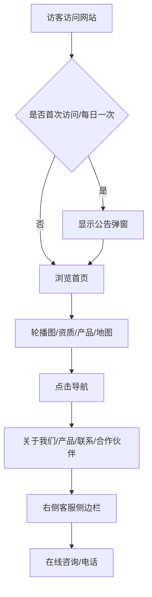
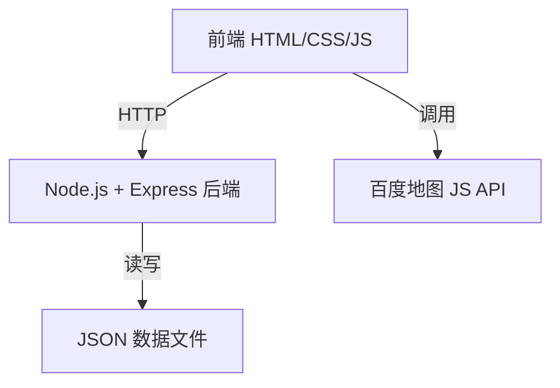

# 语云科技企业官网 — 产品需求文档（PRD）

## 1. 产品概述

语云科技企业官网是一个面向中国市场的多页面企业展示站点，融合魔方财务的专业感、腾讯云的现代科技感以及 Cloudflare 中国官网的简洁布局。网站采用无 MySQL 的轻量级后端架构（Node.js + JSON 文件），并配备完整的后台管理系统，实现所有前端内容的动态配置。

- 目标用户：潜在客户、合作伙伴、投资者
- 核心价值：展示企业资质、产品业务、全球布局，建立品牌信任

## 2. 核心功能

### 2.1 用户角色

| 角色 | 注册/登录方式 | 核心权限 |
|------|--------------|----------|
| 访客 | 无需注册 | 浏览所有页面、查看公告弹窗、使用在线咨询 |
| 管理员 | 后台登录（账号密码） | 配置轮播图、资质、产品、页脚、弹窗、地图标记等 |

### 2.2 功能模块

1. **首页**：全屏轮播图、资质展示、合作伙伴横滚、全球分布地图、产品业务展示
2. **关于我们**：公司信息、地址地图、营销电话、官方群聊二维码
3. **产品介绍**：核心业务与产品网格/卡片展示
4. **联系我们**：联系表单、地址、电话
5. **合作伙伴**：合作伙伴列表与详情
6. **后台管理**：登录、首页配置、页脚配置、弹窗配置、产品管理、合作伙伴管理、地图标记管理

### 2.3 页面详情

| 页面 | 模块 | 功能描述 |
|------|------|----------|
| 首页 | 轮播图 | 全屏自动播放（3秒间隔）、左右切换、底部圆点指示器，内容后台可配置 |
| 首页 | 资质展示 | 营业执照与电子增值服务产业证卡片，后台可配置图片与文字 |
| 首页 | 合作伙伴横滚 | 自动循环滚动 Logo 墙，可暂停，后台可配置 |
| 首页 | 全球分布地图 | 百度地图 API，标记中东、欧洲、北京、青岛、莫斯科、圣彼得堡、首尔、新加坡、澳大利亚、纽约、华盛顿、旧金山，后台可配置 |
| 首页 | 产品业务 | 网格/卡片布局展示核心业务，后台可配置 |
| 关于我们 | 公司信息 | 公司名称、地址、详细介绍、营销电话 400-800-8541、官方群聊二维码 |
| 页脚 | 信息展示 | 黑色背景、Logo、橙色销售电话 400-800-8451、备案号、资质、授权声明 |
| 全局 | 弹窗系统 | 通知公告弹窗（首次访问/每日一次）、操作提示弹窗、客服侧边栏 |
| 全局 | 导航 | 顶部导航 + 汉堡菜单（移动端）、下拉菜单效果、国际版跳转入口 |

## 3. 核心流程

访客打开网站 → 首次访问弹出公告弹窗（可配置每日一次） → 浏览首页轮播图 → 查看资质与产品 → 点击导航进入其他页面 → 右侧客服侧边栏随时可咨询 → 页脚查看备案与联系方式。

管理员登录后台 → 修改首页/页脚/弹窗/产品/合作伙伴/地图配置 → 保存后前端实时生效。

## 4. 用户界面设计

### 4.1 设计风格

- **主色调**：魔方财务蓝系 `#0052D9`（主色）、`#1677FF`（辅助蓝）、`#E6F0FF`（浅蓝背景）
- **点缀色**：腾讯云活力橙 `#FF6A00`（销售电话、CTA按钮）
- **页脚背景**：Cloudflare 风格纯黑 `#000000`
- **文字颜色**：深灰 `#1D2129`（主文字）、`#4E5969`（次要文字）、`#86909C`（辅助文字）
- **按钮样式**：圆角 4px，主按钮蓝底白字，悬停加深；橙色按钮用于销售电话等强提醒
- **字体**：中文优先使用 "PingFang SC", "Microsoft YaHei", "Noto Sans SC", sans-serif；英文使用 "DIN Alternate", "Helvetica Neue", Arial
- **布局风格**：顶部固定导航（白色背景+阴影），内容区采用卡片式与网格布局，页脚全宽黑色
- **图标风格**：线性图标，2px 描边，与腾讯云/魔方财务同款风格

### 4.2 页面设计概览

| 页面 | 模块 | UI 元素 |
|------|------|---------|
| 首页 | 轮播图 | 全屏宽、高 520px（桌面）/300px（移动），CSS3 fade 过渡，左右箭头、底部圆点 |
| 首页 | 资质展示 | 白色卡片、圆角 8px、阴影、左侧图片右侧文字、两列布局 |
| 首页 | 合作伙伴横滚 | 单行横向滚动、Logo 灰度处理、悬停彩色、自动滚动 CSS animation |
| 首页 | 全球分布地图 | 百度地图容器、自定义标记点图标、信息窗口 |
| 首页 | 产品业务 | 4 列网格（桌面）、2 列（平板）、1 列（手机），卡片含图标、标题、简述、链接 |
| 关于我们 | 公司信息 | 左侧文字介绍、右侧地图嵌入、电话橙色高亮、二维码卡片 |
| 页脚 | 信息展示 | 黑色背景、白色文字、Logo 白色、电话橙色、备案链接灰色、底部声明小字 |
| 全局 | 弹窗 | 居中模态框、圆角 8px、背景遮罩 rgba(0,0,0,0.5)、backdrop-filter blur |
| 全局 | 客服侧边栏 | 右侧固定、宽 60px 收起/280px 展开、白色背景、阴影、含客服图标/电话/工作时间 |

### 4.3 响应式设计

- **桌面优先**：最大宽度 1200px 居中，导航完整展示
- **平板（<1024px）**：产品网格变为 2 列，地图高度降低
- **手机（<768px）**：导航变为汉堡菜单，轮播图高度 300px，产品单列，侧边栏收起为图标

### 4.4 动画与交互

- 轮播图：CSS3 `transition: opacity 0.5s ease-in-out`
- 下拉菜单：`transform: translateY(-10px)` + `opacity` 过渡 0.2s
- 弹窗：`transform: scale(0.95)` → `scale(1)` + `opacity` 过渡 0.2s
- 合作伙伴横滚：`@keyframes scroll { 0% { transform: translateX(0); } 100% { transform: translateX(-50%); } }` 线性无限循环
- 按钮悬停：`background-color` 过渡 0.2s，`box-shadow` 增强
- 页面滚动：导航栏阴影加深

## 5. 技术架构

### 5.1 架构设计

### 5.2 技术栈

- **前端**：HTML5, CSS3 (Flexbox/Grid, CSS变量), JavaScript (ES6+)
- **后端**：Node.js + Express
- **数据存储**：JSON 文件（无 MySQL）
- **地图**：百度地图 JavaScript API
- **部署**：静态文件由 Express 托管

### 5.3 路由定义

| 路由 | 用途 |
|------|------|
| / | 首页 |
| /about.html | 关于我们 |
| /products.html | 产品介绍 |
| /contact.html | 联系我们 |
| /partners.html | 合作伙伴 |
| /admin/ | 后台管理登录页 |
| /admin/dashboard.html | 后台管理主面板 |
| /api/config/home | 获取首页配置 |
| /api/config/footer | 获取页脚配置 |
| /api/config/popup | 获取弹窗配置 |
| /api/config/products | 获取/更新产品配置 |
| /api/config/partners | 获取/更新合作伙伴配置 |
| /api/config/map | 获取/更新地图标记配置 |
| /api/admin/login | 管理员登录 |
| /api/admin/verify | 验证登录状态 |

## 6. 数据模型

### 6.1 JSON 数据结构

- `data/home.json`：轮播图数组、资质数组、产品数组
- `data/footer.json`：电话、备案号、资质、授权声明
- `data/popup.json`：公告标题、内容、顶栏颜色、按钮颜色、每日一次开关
- `data/partners.json`：合作伙伴 Logo URL、名称、链接数组
- `data/map.json`：标记点数组（名称、经纬度、简介）
- `data/admin.json`：管理员账号密码（bcrypt 加密）

## 7. 后台管理功能

- 登录验证（JWT Token）
- 首页轮播图增删改查（图片URL、标题、描述、链接）
- 资质展示配置（图片URL、标题、描述）
- 产品业务管理（图标、标题、简述、链接）
- 合作伙伴管理（Logo、名称、链接）
- 地图标记管理（名称、经纬度、简介）
- 页脚信息配置（电话、备案号、资质、声明）
- 弹窗配置（标题、内容、颜色、每日一次开关）
- 修改后立即生效（前端每次加载时请求最新配置）
