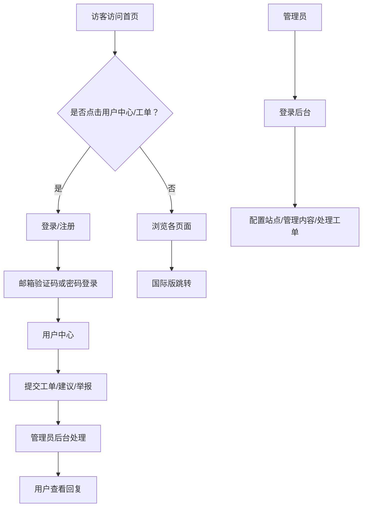

# 语云科技中国企业官网产品需求文档

## 1. 产品概述

语云科技企业官网是一个面向中文用户、可部署于虚拟主机的多页面 PHP 网站。网站参考魔方财务、Cloudflare 中国官网、腾讯云官网等主流企业站的视觉风格，提供公司形象展示、产品服务、合作伙伴、全球节点地图、用户注册登录、工单系统、建议举报以及完整的后台内容管理系统。

目标用户：潜在客户、合作伙伴、现有用户、网站管理员。

## 2. 核心功能

### 2.1 用户角色

| 角色 | 注册方式 | 核心权限 |
|------|----------|----------|
| 访客 | 无需注册 | 浏览首页、关于我们、产品介绍、联系我们、合作伙伴、国际版跳转 |
| 普通用户 | 邮箱注册 + 邮箱验证码登录 | 进入用户中心、提交工单、提交建议/举报 |
| 管理员 | 后台预置账号 / 用户升级为管理员 | 登录后台，管理配置、页面内容、用户、模板、员工卡片 |

### 2.2 功能模块

1. **首页**：顶部导航 + 汉堡菜单、轮播图、业务/产品卡片、合作伙伴横向滚动、全球节点地图、资质证照、员工卡片、页脚。
2. **关于我们**：公司名称、简介、地址、营销电话、官方群聊、地图。
3. **公司简介**：更详细的公司发展历程、文化、荣誉。
4. **产品介绍**：产品/服务列表、详情弹窗。
5. **联系我们**：联系表单、联系方式、地图。
6. **合作伙伴**：合作伙伴 LOGO/名称列表。
7. **国际版官网**：点击跳转至 `https://cloud.loveym.cloud`。
8. **用户中心**：登录/注册、邮箱验证码登录、个人资料、我的工单、提交建议/举报。
9. **后台管理**：站点配置、轮播/产品/合作伙伴/员工卡片管理、用户管理、模板选择与上传、工单处理、备案信息。
10. **安装程序**：向导式安装，检测环境、创建 SQLite 数据库、初始化管理员账号。

### 2.3 页面详情

| 页面 | 模块 | 功能说明 |
|------|------|----------|
| index.php | 轮播图 | 后台可配置多张轮播图，自动切换，支持标题与按钮 |
| index.php | 业务/产品 | 卡片式展示，后台可编辑 |
| index.php | 合作伙伴滚动 | 横向无限滚动，后台可管理 |
| index.php | 全球节点地图 | 静态 SVG/Canvas 地图，标注多个节点城市 |
| index.php | 资质证照 | 展示营业执照、电子增值服务产业证等 |
| index.php | 员工卡片 | 后台可添加/编辑/删除员工展示卡片 |
| about.php | 公司信息 | 读取后台配置，展示名称、地址、电话、群聊 |
| products.php | 产品列表 | 读取后台产品数据，点击弹窗显示详情 |
| contact.php | 联系方式/表单 | 表单提交到后台或发送邮件 |
| partners.php | 合作伙伴 | 读取后台合作伙伴数据 |
| login.php / register.php | 用户认证 | 邮箱注册、邮箱验证码登录、密码登录 |
| user/ | 用户中心 | 提交工单、查看工单回复、提交建议/举报 |
| admin/ | 后台管理 | 仪表盘、配置、内容管理、用户、模板、工单 |
| install/ | 安装向导 | 环境检测、数据库初始化、管理员创建 |

## 3. 核心流程

## 4. 用户界面设计

### 4.1 设计风格

- **主色调**：深色（Cloudflare 同款 `#000000` 页脚）+ 品牌橙色 `#FF6A00`（销售电话、按钮、高亮）+ 白色/浅灰背景。
- **按钮**：圆角 6-8px，主按钮橙色渐变，悬停加深。
- **字体**：中文使用系统字体栈 `"PingFang SC", "Microsoft YaHei", sans-serif`；英文/数字使用 `Inter, Arial`。
- **布局**：顶部固定导航，容器最大宽度 1200px，卡片式布局，充足留白。
- **图标**：使用 Font Awesome 6 Free，辅以 Bootstrap Icons；不使用侵权图标。

### 4.2 页面设计概览

| 页面 | 模块 | UI 元素 |
|------|------|---------|
| 首页 | 导航 | 顶部固定、LOGO、菜单、汉堡菜单、右侧客服/联系 |
| 首页 | 轮播 | 全宽轮播、渐变遮罩、标题动画、指示器 |
| 首页 | 产品 | 三列网格卡片、图标、悬停阴影 |
| 首页 | 合作伙伴 | 单行横向自动滚动 LOGO |
| 首页 | 地图 | 世界地图 SVG，节点脉冲动画 |
| 首页 | 页脚 | 黑色背景、橙色销售电话、备案信息 |
| 用户中心 | 侧边栏 | 菜单、统计卡片、工单表格 |
| 后台 | 侧边栏 | 深色侧边栏、仪表盘、列表页、表单页 |

### 4.3 响应式设计

- **桌面优先**，断点：1200px、992px、768px、576px。
- 移动端：汉堡菜单折叠、轮播高度降低、卡片单列、地图简化显示。
- 图片与字体使用相对单位，确保缩放自然。

## 5. 数据与模板

- 默认模板：`templates/default/`。
- 后台支持上传新模板 ZIP，解压到 `templates/` 目录并切换。
- 模板文件使用 PHP include 读取公共配置，支持响应式与基础动画。

## 6. 非功能需求

- **性能**：静态资源启用浏览器缓存；图片 lazy loading；CSS/JS 压缩建议由上线时完成。
- **安全**：密码使用 `password_hash`；SQL 使用 PDO 预处理；输出使用 `htmlspecialchars`；后台需 CSRF Token。
- **兼容**：支持 PHP 7.4+ 与 PHP 8.x，支持 SQLite（默认）与可选 MySQL（安装时选择）。
