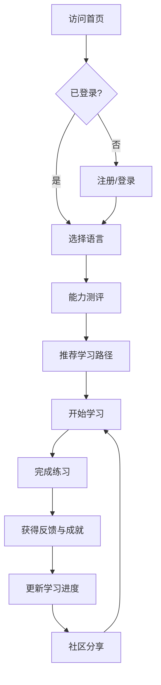
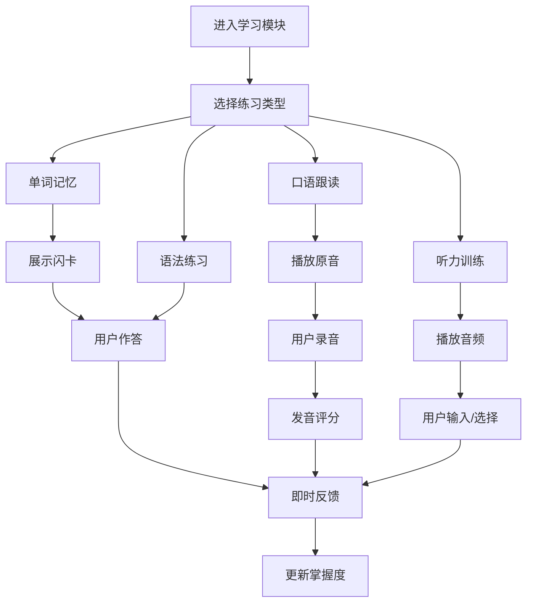

# 产品需求文档（PRD）

## 1. 产品概述

LinguaFlow 是一款沉浸式多语种在线教育平台，专注于英语、日语、韩语等主流语言学习。平台通过分级课程、互动练习、口语跟读、听力训练等模块，结合个性化学习路径与社区激励机制，帮助用户实现高效、有趣的语言习得。

## 2. 核心功能

### 2.1 用户角色

| 角色 | 注册方式 | 核心权限 |
|------|----------|----------|
| 普通用户 | 邮箱/手机号注册 | 浏览课程、学习练习、查看进度、社区互动 |
| 会员用户 | 订阅升级 | 解锁高级课程、专属学习报告、无广告体验 |
| 管理员 | 后台配置 | 课程管理、用户管理、数据统计 |

### 2.2 功能模块

1. **首页（Home）**：平台介绍、热门课程、学习入口、用户成就展示
2. **课程中心（Courses）**：分级课程体系、语言筛选、课程详情
3. **互动学习（Learn）**：单词记忆、语法练习、口语跟读、听力训练
4. **学习进度（Progress）**：学习日历、能力雷达图、成就徽章、学习统计
5. **个人中心（Profile）**：用户信息、学习偏好、会员状态、设置
6. **社区（Community）**：学习动态、话题讨论、排行榜、成就激励
7. **登录/注册（Auth）**：用户注册、登录、找回密码

### 2.3 页面详情

| 页面名称 | 模块名称 | 功能描述 |
|----------|----------|----------|
| 首页 | Hero 区域 | 沉浸式视觉展示，动态语言切换效果，快速开始学习 CTA |
| 首页 | 热门课程 | 展示英语、日语、韩语热门课程卡片，支持快速预览 |
| 首页 | 学习数据概览 | 展示平台总用户数、课程数、学习时长等数据 |
| 首页 | 用户成就墙 | 滚动展示用户获得成就徽章，增强社区氛围 |
| 课程中心 | 课程筛选 | 按语言、难度等级、课程类型筛选 |
| 课程中心 | 课程列表 | 卡片式展示课程封面、标题、难度、学习人数 |
| 课程中心 | 课程详情 | 课程大纲、学习目标、试学按钮、用户评价 |
| 互动学习 | 单词记忆 | 闪卡式单词学习，支持翻转、发音、例句展示 |
| 互动学习 | 语法练习 | 选择题、填空题、拖拽排序等互动题型 |
| 互动学习 | 口语跟读 | 录音对比、发音评分、波形可视化 |
| 互动学习 | 听力训练 | 音频播放、变速调节、听写练习 |
| 学习进度 | 能力雷达图 | 展示听、说、读、写、词汇五维能力 |
| 学习进度 | 学习日历 | 热力图形式展示每日学习时长 |
| 学习进度 | 成就徽章 | 网格展示已解锁/未解锁成就 |
| 社区 | 学习动态 | 用户学习打卡、心得分享流 |
| 社区 | 排行榜 | 周榜/月榜/总榜，按学习时长、连续天数排名 |
| 登录/注册 | 登录表单 | 邮箱/手机号 + 密码登录，支持第三方登录 |
| 登录/注册 | 注册表单 | 邮箱/手机号注册，验证码校验 |

## 3. 核心流程

### 3.1 用户注册与学习流程

### 3.2 互动学习流程

## 4. 用户界面设计

### 4.1 设计风格

- **整体风格**：沉浸式、现代、活力、教育科技感
- **主色调**：深靛蓝（#1e1b4b）作为主色，亮青柠（#84cc16）作为强调色
- **辅助色**：暖白（#fafaf9）、浅灰（#e7e5e4）、深灰（#44403c）
- **按钮风格**：圆角矩形（12px），主按钮使用渐变背景（靛蓝到紫罗兰），悬浮时带有光晕效果
- **字体**：
  - 标题字体："Noto Sans SC"（中文）+ "Poppins"（英文数字），字重 700-800
  - 正文字体："Noto Sans SC" + "Inter"，字重 400-500
  - 特殊数字/数据："Space Grotesk"，字重 600
- **布局风格**：卡片式布局，大量留白，非对称网格，圆角 16px
- **图标风格**：Lucide 图标，线条风格，2px 描边

### 4.2 页面设计概览

| 页面名称 | 模块名称 | UI 元素 |
|----------|----------|---------|
| 首页 | Hero 区域 | 全屏渐变背景（深靛蓝到紫罗兰），动态漂浮语言字符（英/日/韩文），大标题"开启你的语言之旅"，CTA 按钮带脉冲动画 |
| 首页 | 热门课程 | 横向滚动卡片，悬停时卡片上浮并展示课程简介，语言标签带国旗 emoji |
| 首页 | 学习数据 | 大数字计数动画，三列布局，数字使用 Space Grotesk 字体 |
| 首页 | 成就墙 | 无限横向滚动，徽章图标带发光效果 |
| 课程中心 | 筛选栏 | 胶囊式筛选按钮，选中状态带下划线动画 |
| 课程中心 | 课程卡片 | 封面图 + 渐变遮罩，难度标签，学习进度条 |
| 互动学习 | 单词闪卡 | 3D 翻转效果，正面单词+音标，背面释义+例句 |
| 互动学习 | 语法练习 | 选项卡片，选中时缩放+边框高亮，答对绿色/答错红色抖动 |
| 互动学习 | 口语跟读 | 音频波形可视化，录音按钮带波纹动画，评分环形进度条 |
| 互动学习 | 听力训练 | 播放器控件，变速按钮组，听写输入框 |
| 学习进度 | 雷达图 | 五维能力雷达图，渐变填充，动画展开 |
| 学习进度 | 日历热力图 | GitHub 风格热力图，颜色深浅表示学习时长 |
| 社区 | 动态流 | 瀑布流布局，用户头像+昵称+内容+点赞评论 |
| 社区 | 排行榜 | 前三名特殊奖杯图标，列表项带排名变化箭头 |

### 4.3 响应式设计

- **桌面端优先**：最大宽度 1440px，居中布局
- **平板适配**：768px-1024px，课程网格 2 列，侧边栏收起
- **移动端适配**：< 768px，单列布局，底部固定导航栏，手势滑动切换练习

### 4.4 动画与交互

- **页面加载**：Hero 区域文字逐字淡入，背景粒子缓慢漂浮
- **滚动触发**：模块进入视口时向上淡入（translateY 30px -> 0, opacity 0 -> 1）
- **悬停效果**：卡片上浮（translateY -8px），阴影加深，图片微缩放（scale 1.05）
- **按钮交互**：点击时涟漪效果，主按钮持续微光扫过（shimmer）
- **学习反馈**：答对时绿色勾号+ confetti 效果，答错时红色抖动+正确提示
- **进度动画**：环形进度条、数字计数、雷达图展开均使用缓动动画（ease-out）

## 5. 非功能需求

- **性能**：首屏加载 < 2s，交互响应 < 100ms
- **可访问性**：支持键盘导航，ARIA 标签，颜色对比度 WCAG AA 级
- **浏览器兼容**：Chrome、Firefox、Safari、Edge 最新两个版本
