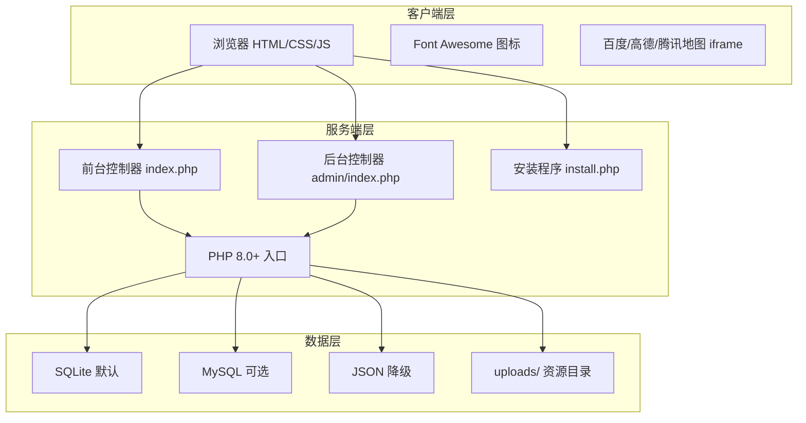

# 语云科技中国企业官网 - 技术架构文档

## 1. 架构设计



## 2. 技术选型

- **服务端语言**：PHP 8.0+（兼容 7.4）
- **前端技术**：原生 HTML5 + CSS3 + JavaScript（ES6+）
- **样式方案**：自定义 CSS 变量 + 媒体查询，支持多主题模板
- **数据存储**：
  - 默认：SQLite3（单文件 `data/yuyun.db`）
  - 可选：MySQL（安装时配置）
  - 降级：JSON 文件（`data/*.json`）
- **图标库**：Font Awesome 6（CDN）
- **地图**：百度/高德/腾讯地图 iframe 嵌入（后台配置密钥）
- **图片上传**：PHP 原生文件上传，限制类型与大小

## 3. 项目结构

```
yuyun-official/
├── index.php                 # 前台入口（路由到对应页面）
├── install.php               # 安装程序
├── config.php                # 配置文件（安装后生成）
├── .htaccess                 # URL 重写/安全规则
├── data/                     # 数据目录（需可写）
│   ├── yuyun.db              # SQLite 数据库
│   ├── backup/               # 备份文件
│   └── json/                 # JSON 降级数据
├── uploads/                  # 上传文件目录
│   ├── logo/
│   ├── slides/
│   ├── certs/
│   ├── partners/
│   └── products/
├── includes/                 # 公共 PHP 文件
│   ├── db.php                # 数据库抽象层
│   ├── functions.php         # 公共函数
│   ├── auth.php              # 后台认证
│   └── config_loader.php     # 配置加载
├── templates/                # 前台模板
│   ├── default/              # 默认企业蓝
│   ├── dark/                 # 科技黑
│   └── white/                # 云白
│       ├── css/
│       ├── js/
│       └── partials/
├── admin/                    # 后台管理
│   ├── index.php             # 后台入口/仪表盘
│   ├── login.php             # 登录页
│   ├── logout.php            # 退出
│   ├── settings.php          # 站点配置
│   ├── slides.php            # 轮播图管理
│   ├── products.php          # 产品管理
│   ├── partners.php          # 合作伙伴
│   ├── links.php             # 友情链接
│   ├── certs.php             # 证书管理
│   ├── messages.php          # 留言管理
│   ├── backup.php            # 备份恢复
│   └── assets/               # 后台静态资源
└── pages/                    # 前台页面内容
    ├── home.php
    ├── about.php
    ├── company.php
    ├── products.php
    ├── contact.php
    ├── partners.php
    └── international.php
```

## 4. 路由定义

| 路由 | 用途 |
|------|------|
| `/` 或 `index.php` | 前台首页 |
| `?page=about` | 关于我们 |
| `?page=company` | 公司简介 |
| `?page=products` | 产品介绍 |
| `?page=contact` | 联系我们 |
| `?page=partners` | 合作伙伴 |
| `?page=international` | 国际版官网跳转 |
| `/admin/` | 后台登录/仪表盘 |
| `/admin/login.php` | 后台登录 |
| `/admin/settings.php` | 站点配置 |
| `/admin/slides.php` | 轮播图管理 |
| `/admin/products.php` | 产品管理 |
| `/admin/partners.php` | 合作伙伴管理 |
| `/admin/links.php` | 友情链接 |
| `/admin/certs.php` | 证书管理 |
| `/admin/messages.php` | 留言管理 |
| `/admin/backup.php` | 备份恢复 |

## 5. 数据库模型

### 5.1 核心表结构

```sql
-- 站点配置
CREATE TABLE settings (
    id INTEGER PRIMARY KEY AUTOINCREMENT,
    s_key VARCHAR(100) NOT NULL UNIQUE,
    s_value TEXT,
    updated_at DATETIME DEFAULT CURRENT_TIMESTAMP
);

-- 轮播图
CREATE TABLE slides (
    id INTEGER PRIMARY KEY AUTOINCREMENT,
    title VARCHAR(255),
    subtitle TEXT,
    image VARCHAR(255),
    link VARCHAR(255),
    btn_text VARCHAR(100),
    sort_order INT DEFAULT 0,
    is_active TINYINT DEFAULT 1,
    created_at DATETIME DEFAULT CURRENT_TIMESTAMP
);

-- 产品/服务
CREATE TABLE products (
    id INTEGER PRIMARY KEY AUTOINCREMENT,
    icon VARCHAR(100),
    title VARCHAR(255),
    summary TEXT,
    detail TEXT,
    image VARCHAR(255),
    sort_order INT DEFAULT 0,
    is_active TINYINT DEFAULT 1
);

-- 合作伙伴
CREATE TABLE partners (
    id INTEGER PRIMARY KEY AUTOINCREMENT,
    name VARCHAR(255),
    logo VARCHAR(255),
    link VARCHAR(255),
    sort_order INT DEFAULT 0,
    is_active TINYINT DEFAULT 1
);

-- 友情链接
CREATE TABLE links (
    id INTEGER PRIMARY KEY AUTOINCREMENT,
    name VARCHAR(255),
    url VARCHAR(255),
    sort_order INT DEFAULT 0
);

-- 证书资质
CREATE TABLE certificates (
    id INTEGER PRIMARY KEY AUTOINCREMENT,
    name VARCHAR(255),
    image VARCHAR(255),
    description TEXT,
    sort_order INT DEFAULT 0
);

-- 用户留言
CREATE TABLE messages (
    id INTEGER PRIMARY KEY AUTOINCREMENT,
    name VARCHAR(100),
    phone VARCHAR(50),
    email VARCHAR(100),
    content TEXT,
    status TINYINT DEFAULT 0,
    created_at DATETIME DEFAULT CURRENT_TIMESTAMP
);

-- 管理员
CREATE TABLE admins (
    id INTEGER PRIMARY KEY AUTOINCREMENT,
    username VARCHAR(100) UNIQUE,
    password VARCHAR(255),
    created_at DATETIME DEFAULT CURRENT_TIMESTAMP
);
```

## 6. 配置项设计

| 配置项 | 说明 |
|--------|------|
| `site_title` | 网站标题 |
| `site_logo` | 网站 LOGO |
| `site_favicon` | 网站图标 |
| `site_keywords` | SEO 关键词 |
| `site_description` | SEO 描述 |
| `company_name` | 公司名称 |
| `company_address` | 公司地址 |
| `company_intro` | 公司简介 |
| `sales_phone` | 销售电话（默认 400-800-8451） |
| `service_phone` | 客服电话 |
| `company_email` | 企业邮箱 |
| `group_chat` | 官方群聊链接 |
| `icp` | 备案号 |
| `icp_gongan` | 公安网备案号 |
| `license` | 增值电信业务经营许可证号 |
| `footer_text` | 页脚授权文字 |
| `map_type` | 地图类型（baidu/gaode/tencent） |
| `map_key` | 地图密钥 |
| `map_lat` | 地图纬度 |
| `map_lng` | 地图经度 |
| `current_template` | 当前模板 |
| `popup_enabled` | 首页弹窗是否启用 |
| `popup_title` | 弹窗标题 |
| `popup_content` | 弹窗内容 |
| `international_url` | 国际版链接 |

## 7. 安全设计

- 密码使用 `password_hash()` + `password_verify()`
- 后台使用 Session + CSRF Token
- 表单输入基础过滤，输出转义
- 文件上传限制类型（jpg/png/gif/webp/svg），限制大小
- `data/` 与 `uploads/` 目录通过 `.htaccess` 限制 PHP 执行

## 8. 安装流程

1. 访问 `/install.php`
2. 检测 PHP 版本、SQLite/MySQL 扩展、目录可写性
3. 选择存储类型（SQLite/MySQL/JSON）
4. 配置数据库（如 MySQL）或确认 SQLite 路径
5. 创建管理员账号
6. 初始化默认数据（轮播图、产品、合作伙伴、证书、配置项）
7. 生成 `config.php` 并锁定安装程序

## 9. 模板机制

- 模板目录：`templates/{theme}/`
- 每个模板包含 `style.css`、`main.js`、`partials/` 片段
- 后台切换 `current_template` 后前台自动加载对应模板资源
- 默认提供三套模板：
  - `default`：企业蓝（腾讯云风格）
  - `dark`：科技黑（Cloudflare 深色风格）
  - `white`：云白（魔方财务浅色风格）
