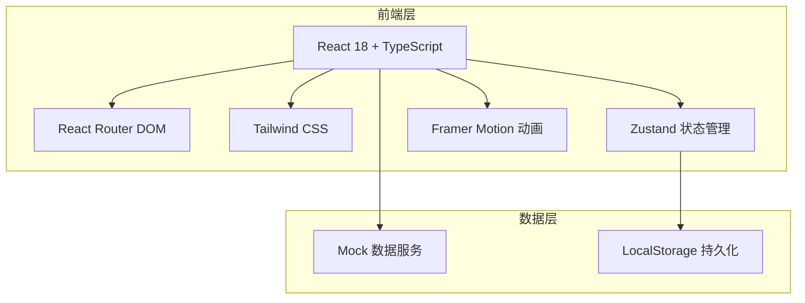

# 技术架构文档

## 1. 架构设计



## 2. 技术选型

- **前端框架**：React 18 + TypeScript
- **构建工具**：Vite
- **样式方案**：Tailwind CSS 3
- **状态管理**：Zustand
- **路由**：React Router DOM v6
- **动画库**：Framer Motion
- **图标库**：Lucide React
- **图表库**：自定义 SVG 雷达图 + Recharts（热力图/柱状图）
- **字体**：Google Fonts（Noto Sans SC、Poppins、Space Grotesk）

## 3. 路由定义

| 路由 | 用途 |
|------|------|
| / | 首页 |
| /courses | 课程中心 |
| /courses/:id | 课程详情 |
| /learn | 互动学习主页 |
| /learn/vocabulary | 单词记忆 |
| /learn/grammar | 语法练习 |
| /learn/speaking | 口语跟读 |
| /learn/listening | 听力训练 |
| /progress | 学习进度 |
| /community | 社区 |
| /profile | 个人中心 |
| /login | 登录 |
| /register | 注册 |

## 4. 项目结构

```
src/
├── components/          # 公共组件
│   ├── Layout.tsx       # 页面布局（导航+侧边栏+底部）
│   ├── Navbar.tsx       # 顶部导航
│   ├── Footer.tsx       # 页脚
│   ├── CourseCard.tsx   # 课程卡片
│   ├── FlashCard.tsx    # 单词闪卡
│   ├── RadarChart.tsx   # 能力雷达图
│   ├── HeatmapCalendar.tsx # 学习热力图
│   ├── AchievementBadge.tsx # 成就徽章
│   ├── LeaderboardItem.tsx  # 排行榜项
│   └── AnimatedCounter.tsx  # 数字计数动画
├── pages/               # 页面组件
│   ├── Home.tsx
│   ├── Courses.tsx
│   ├── CourseDetail.tsx
│   ├── Learn.tsx
│   ├── Vocabulary.tsx
│   ├── Grammar.tsx
│   ├── Speaking.tsx
│   ├── Listening.tsx
│   ├── Progress.tsx
│   ├── Community.tsx
│   ├── Profile.tsx
│   ├── Login.tsx
│   └── Register.tsx
├── hooks/               # 自定义 Hooks
│   ├── useAuth.ts
│   ├── useProgress.ts
│   └── useLocalStorage.ts
├── stores/              # Zustand 状态
│   ├── authStore.ts
│   ├── courseStore.ts
│   ├── learnStore.ts
│   └── progressStore.ts
├── data/                # Mock 数据
│   ├── courses.ts
│   ├── vocabulary.ts
│   ├── grammar.ts
│   ├── achievements.ts
│   └── community.ts
├── types/               # TypeScript 类型
│   └── index.ts
├── utils/               # 工具函数
│   └── helpers.ts
├── App.tsx
└── main.tsx
```

## 5. 数据模型

### 5.1 核心类型定义

```typescript
// 用户
interface User {
  id: string;
  email: string;
  nickname: string;
  avatar: string;
  memberType: 'free' | 'premium';
  nativeLanguage: string;
  learningLanguages: string[];
  createdAt: string;
}

// 课程
interface Course {
  id: string;
  title: string;
  description: string;
  language: 'english' | 'japanese' | 'korean';
  level: 'beginner' | 'intermediate' | 'advanced';
  coverImage: string;
  totalLessons: number;
  completedLessons: number;
  duration: number;
  rating: number;
  studentsCount: number;
  tags: string[];
}

// 单词
interface Word {
  id: string;
  word: string;
  phonetic: string;
  translation: string;
  example: string;
  exampleTranslation: string;
  language: string;
  difficulty: number;
}

// 语法题目
interface GrammarQuestion {
  id: string;
  type: 'choice' | 'fill' | 'sort';
  question: string;
  options?: string[];
  correctAnswer: string | string[];
  explanation: string;
  difficulty: number;
}

// 学习进度
interface LearningProgress {
  userId: string;
  language: string;
  skills: {
    listening: number;
    speaking: number;
    reading: number;
    writing: number;
    vocabulary: number;
  };
  streakDays: number;
  totalStudyTime: number;
  completedCourses: string[];
  dailyLog: {
    date: string;
    minutes: number;
  }[];
}

// 成就
interface Achievement {
  id: string;
  name: string;
  description: string;
  icon: string;
  condition: string;
  unlockedAt?: string;
}

// 社区动态
interface Post {
  id: string;
  userId: string;
  userName: string;
  userAvatar: string;
  content: string;
  images?: string[];
  likes: number;
  comments: number;
  createdAt: string;
}
```

## 6. 状态管理设计

### 6.1 Auth Store

```typescript
interface AuthState {
  user: User | null;
  isLoggedIn: boolean;
  login: (email: string, password: string) => Promise<void>;
  register: (email: string, password: string, nickname: string) => Promise<void>;
  logout: () => void;
}
```

### 6.2 Course Store

```typescript
interface CourseState {
  courses: Course[];
  filteredCourses: Course[];
  selectedLanguage: string | null;
  selectedLevel: string | null;
  setFilter: (language?: string, level?: string) => void;
  enrollCourse: (courseId: string) => void;
}
```

### 6.3 Learn Store

```typescript
interface LearnState {
  currentWordIndex: number;
  words: Word[];
  grammarQuestions: GrammarQuestion[];
  currentQuestionIndex: number;
  score: number;
  nextWord: () => void;
  answerQuestion: (answer: string) => boolean;
  reset: () => void;
}
```

### 6.4 Progress Store

```typescript
interface ProgressState {
  progress: LearningProgress;
  achievements: Achievement[];
  updateSkill: (skill: string, value: number) => void;
  addStudyTime: (minutes: number) => void;
  unlockAchievement: (achievementId: string) => void;
}
```

## 7. 动画实现方案

| 动画效果 | 实现方式 |
|----------|----------|
| Hero 文字淡入 | Framer Motion staggerChildren |
| 背景漂浮字符 | CSS @keyframes + random delay |
| 卡片悬停上浮 | Tailwind hover:translate-y + transition |
| 按钮 shimmer | CSS pseudo-element + animation |
| 页面滚动淡入 | Framer Motion whileInView |
| 闪卡 3D 翻转 | CSS transform-style: preserve-3d + rotateY |
| 答对 confetti | Canvas confetti 库 |
| 答错抖动 | Framer Motion animate x 左右偏移 |
| 雷达图展开 | SVG path animation + Framer Motion |
| 数字计数 | 自定义 hook + requestAnimationFrame |
| 录音波纹 | CSS ripple animation |

## 8. 本地存储策略

- **用户登录状态**：LocalStorage 存储 token + 用户信息
- **学习进度**：LocalStorage 自动同步，刷新不丢失
- **课程学习记录**：记录已完成的课程和单元
- **用户设置**：语言偏好、主题设置

## 9. Mock 数据策略

由于本项目为纯前端演示，所有数据使用 Mock 数据：

- `src/data/courses.ts`：10+ 门课程数据（英语/日语/韩语）
- `src/data/vocabulary.ts`：每语言 50+ 单词
- `src/data/grammar.ts`：每语言 30+ 语法题目
- `src/data/achievements.ts`：20+ 成就定义
- `src/data/community.ts`：15+ 社区动态

数据通过 Zustand store 加载，模拟异步 API 请求（setTimeout 100-300ms）。
