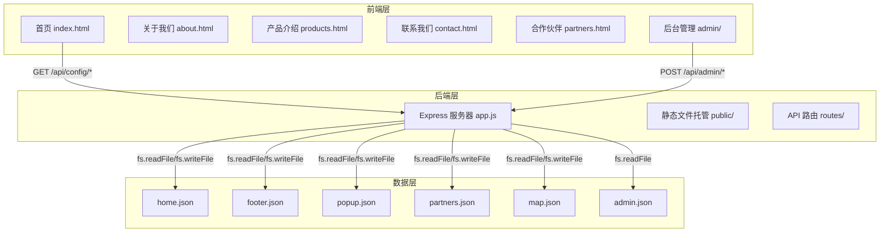
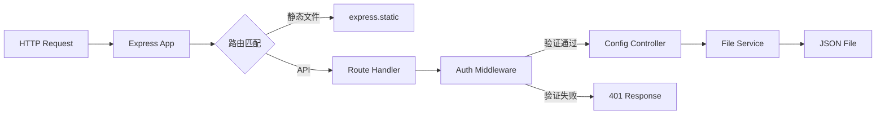

# 语云科技企业官网 — 技术架构文档

## 1. 架构设计



## 2. 技术描述

- **前端**：HTML5 + CSS3 + JavaScript (ES6+)，无框架，纯原生实现
- **后端**：Node.js + Express
- **数据存储**：JSON 文件（无 MySQL/SQLite）
- **地图服务**：百度地图 JavaScript API v3.0
- **部署**：Express 托管静态文件，前后端同端口运行

## 3. 路由定义

| 路由 | 用途 | 方法 |
|------|------|------|
| / | 首页 | GET |
| /about.html | 关于我们 | GET |
| /products.html | 产品介绍 | GET |
| /contact.html | 联系我们 | GET |
| /partners.html | 合作伙伴 | GET |
| /admin/ | 后台登录页 | GET |
| /admin/dashboard.html | 后台管理面板 | GET |
| /api/config/home | 获取首页配置 | GET |
| /api/config/footer | 获取页脚配置 | GET |
| /api/config/popup | 获取弹窗配置 | GET |
| /api/config/products | 获取产品配置 | GET |
| /api/config/partners | 获取合作伙伴配置 | GET |
| /api/config/map | 获取地图标记配置 | GET |
| /api/config/home | 更新首页配置 | POST |
| /api/config/footer | 更新页脚配置 | POST |
| /api/config/popup | 更新弹窗配置 | POST |
| /api/config/products | 更新产品配置 | POST |
| /api/config/partners | 更新合作伙伴配置 | POST |
| /api/config/map | 更新地图标记配置 | POST |
| /api/admin/login | 管理员登录 | POST |
| /api/admin/verify | 验证 Token | GET |

## 4. API 定义

### 4.1 获取配置（通用响应格式）

```typescript
interface ApiResponse<T> {
  success: boolean;
  data: T;
  message?: string;
}

// GET /api/config/home
interface HomeConfig {
  banners: Array<{
    image: string;
    title: string;
    description: string;
    link: string;
  }>;
  certificates: Array<{
    image: string;
    title: string;
    description: string;
  }>;
  products: Array<{
    icon: string;
    title: string;
    description: string;
    link: string;
  }>;
}

// GET /api/config/footer
interface FooterConfig {
  phone: string;
  icp: string;
  icpLink: string;
  certificate: string;
  police: string;
  policeLink: string;
  statement: string;
}

// GET /api/config/popup
interface PopupConfig {
  enabled: boolean;
  title: string;
  content: string;
  headerColor: string;
  buttonColor: string;
  oncePerDay: boolean;
}

// GET /api/config/partners
interface PartnersConfig {
  partners: Array<{
    name: string;
    logo: string;
    link: string;
  }>;
}

// GET /api/config/map
interface MapConfig {
  markers: Array<{
    name: string;
    lng: number;
    lat: number;
    description: string;
  }>;
}
```

### 4.2 管理员登录

```typescript
// POST /api/admin/login
interface LoginRequest {
  username: string;
  password: string;
}

interface LoginResponse {
  success: boolean;
  token?: string;
  message?: string;
}

// GET /api/admin/verify
// Headers: Authorization: Bearer <token>
interface VerifyResponse {
  success: boolean;
  valid: boolean;
}
```

## 5. 服务器架构



## 6. 数据模型

### 6.1 数据定义

所有数据以 JSON 文件形式存储在 `server/data/` 目录下：

- `home.json`：首页轮播图、资质、产品
- `footer.json`：页脚电话、备案、资质、声明
- `popup.json`：弹窗标题、内容、颜色配置
- `partners.json`：合作伙伴列表
- `map.json`：地图标记点
- `admin.json`：管理员账号（bcrypt 加密密码）

### 6.2 初始数据

各 JSON 文件包含合理的默认数据，确保网站首次启动即可正常展示。

## 7. 安全设计

- 管理员密码使用 bcrypt 加密存储
- 后台 API 使用 JWT Token 验证
- 登录失败限制（5分钟内最多5次）
- 所有 POST 请求验证 Content-Type: application/json
- 静态文件托管限制目录遍历
