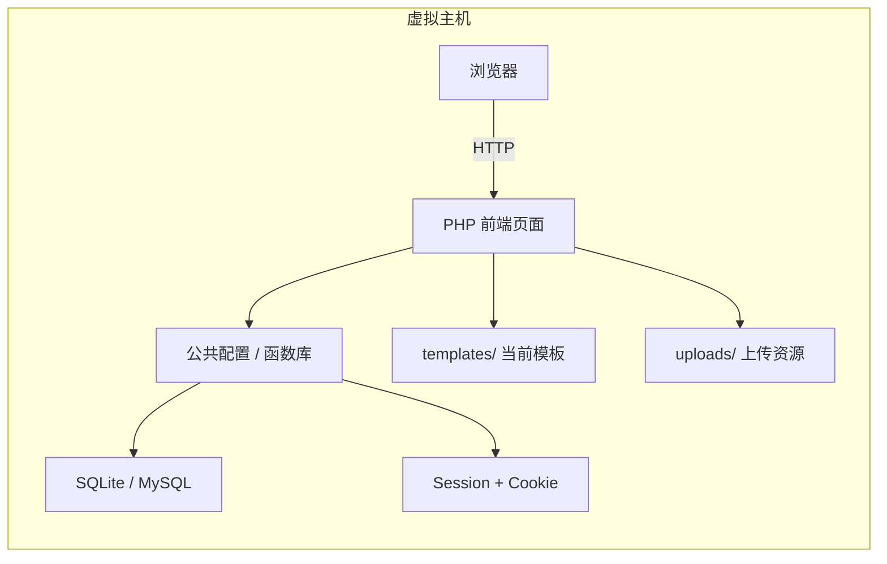
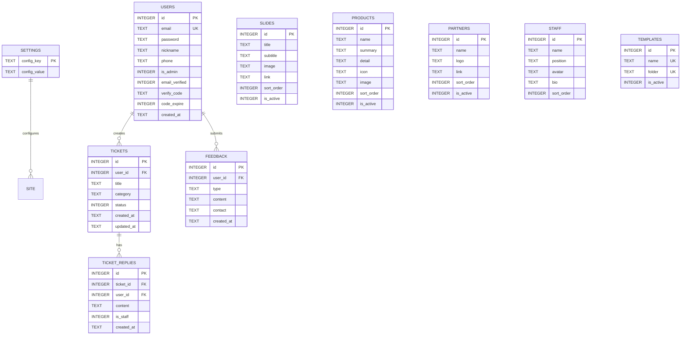

# 语云科技企业官网技术架构文档

## 1. 架构设计



## 2. 技术选型

| 层级 | 技术 | 说明 |
|------|------|------|
| 前端页面 | PHP + HTML5 + CSS3 + JavaScript | 虚拟主机友好，无需构建 |
| 样式框架 | 自定义 CSS + Font Awesome 6 + Bootstrap Icons | 响应式 Grid/Flex |
| 脚本 | 原生 JS（轮播、地图、弹窗、表单校验） | 不依赖大型框架 |
| 后端 | PHP 7.4+ | 路由按文件组织 |
| 数据库 | SQLite（默认）/ MySQL（可选） | PDO 抽象，安装时选择 |
| 会话 | PHP Session | 用户/管理员登录态 |
| 邮件 | PHP mail() / SMTP（配置） | 邮箱验证码、联系表单 |
| 模板系统 | PHP include + 模板变量 | 后台上传/切换模板 |

## 3. 目录结构

```
/workspace/yuyun/
├── index.php              # 首页
├── about.php              # 关于我们
├── company.php            # 公司简介
├── products.php           # 产品介绍
├── contact.php            # 联系我们
├── partners.php           # 合作伙伴
├── login.php              # 登录
├── register.php           # 注册
├── verify.php             # 邮箱验证码登录
├── forgot.php             # 找回密码（可选）
├── assets/
│   ├── css/style.css      # 主样式
│   ├── js/main.js         # 公共脚本
│   └── img/               # 默认图片
├── includes/
│   ├── config.php         # 全局配置加载
│   ├── db.php             # PDO 封装
│   ├── functions.php      # 公共函数
│   ├── header.php         # 页头模板
│   ├── footer.php         # 页脚模板
│   ├── nav.php            # 导航
│   └── admin_header.php   # 后台页头
├── uploads/               # 上传目录
├── templates/
│   └── default/           # 默认模板文件
├── install/               # 安装向导
├── admin/                 # 后台管理
│   ├── index.php          # 仪表盘
│   ├── settings.php       # 站点配置
│   ├── slides.php         # 轮播管理
│   ├── products.php       # 产品管理
│   ├── partners.php       # 合作伙伴
│   ├── staff.php          # 员工卡片
│   ├── users.php          # 用户管理
│   ├── tickets.php        # 工单管理
│   ├── templates.php      # 模板管理
│   └── login.php          # 后台登录
├── user/                  # 用户中心
│   ├── index.php          # 仪表盘
│   ├── profile.php        # 个人资料
│   ├── tickets.php        # 工单
│   └── feedback.php       # 建议/举报
└── data/                  # SQLite 数据目录（安装时创建）
```

## 4. 路由定义

| 路由 | 文件 | 用途 |
|------|------|------|
| / | index.php | 首页 |
| /about.php | about.php | 关于我们 |
| /company.php | company.php | 公司简介 |
| /products.php | products.php | 产品介绍 |
| /contact.php | contact.php | 联系我们 |
| /partners.php | partners.php | 合作伙伴 |
| /login.php | login.php | 用户登录 |
| /register.php | register.php | 用户注册 |
| /verify.php | verify.php | 邮箱验证码登录 |
| /user/ | user/index.php | 用户中心 |
| /admin/ | admin/index.php | 后台首页 |
| /install/ | install/index.php | 安装向导 |

## 5. 数据模型



## 6. 数据库 DDL（SQLite）

```sql
CREATE TABLE settings (
    config_key TEXT PRIMARY KEY,
    config_value TEXT
);

CREATE TABLE users (
    id INTEGER PRIMARY KEY AUTOINCREMENT,
    email TEXT UNIQUE NOT NULL,
    password TEXT,
    nickname TEXT,
    phone TEXT,
    is_admin INTEGER DEFAULT 0,
    email_verified INTEGER DEFAULT 0,
    verify_code TEXT,
    code_expire INTEGER,
    created_at TEXT DEFAULT CURRENT_TIMESTAMP
);

CREATE TABLE tickets (
    id INTEGER PRIMARY KEY AUTOINCREMENT,
    user_id INTEGER NOT NULL,
    title TEXT NOT NULL,
    category TEXT,
    status INTEGER DEFAULT 0,
    created_at TEXT DEFAULT CURRENT_TIMESTAMP,
    updated_at TEXT DEFAULT CURRENT_TIMESTAMP
);

CREATE TABLE ticket_replies (
    id INTEGER PRIMARY KEY AUTOINCREMENT,
    ticket_id INTEGER NOT NULL,
    user_id INTEGER,
    content TEXT NOT NULL,
    is_staff INTEGER DEFAULT 0,
    created_at TEXT DEFAULT CURRENT_TIMESTAMP
);

CREATE TABLE feedback (
    id INTEGER PRIMARY KEY AUTOINCREMENT,
    user_id INTEGER,
    type TEXT,
    content TEXT NOT NULL,
    contact TEXT,
    created_at TEXT DEFAULT CURRENT_TIMESTAMP
);

CREATE TABLE slides (
    id INTEGER PRIMARY KEY AUTOINCREMENT,
    title TEXT,
    subtitle TEXT,
    image TEXT,
    link TEXT,
    sort_order INTEGER DEFAULT 0,
    is_active INTEGER DEFAULT 1
);

CREATE TABLE products (
    id INTEGER PRIMARY KEY AUTOINCREMENT,
    name TEXT NOT NULL,
    summary TEXT,
    detail TEXT,
    icon TEXT,
    image TEXT,
    sort_order INTEGER DEFAULT 0,
    is_active INTEGER DEFAULT 1
);

CREATE TABLE partners (
    id INTEGER PRIMARY KEY AUTOINCREMENT,
    name TEXT NOT NULL,
    logo TEXT,
    link TEXT,
    sort_order INTEGER DEFAULT 0,
    is_active INTEGER DEFAULT 1
);

CREATE TABLE staff (
    id INTEGER PRIMARY KEY AUTOINCREMENT,
    name TEXT NOT NULL,
    position TEXT,
    avatar TEXT,
    bio TEXT,
    sort_order INTEGER DEFAULT 0
);

CREATE TABLE templates (
    id INTEGER PRIMARY KEY AUTOINCREMENT,
    name TEXT UNIQUE NOT NULL,
    folder TEXT UNIQUE NOT NULL,
    is_active INTEGER DEFAULT 0
);
```

## 7. 安全与部署

- 安装目录 `install/` 在完成安装后应删除或重命名。
- `data/` 与 `uploads/` 目录应禁止外部直接执行脚本（通过 .htaccess 设置）。
- 管理员密码强制使用 `password_hash`。
- 所有表单提交需校验 CSRF Token。
- 上传文件限制类型为 jpg/png/webp/ico/zip，大小限制 5MB。
