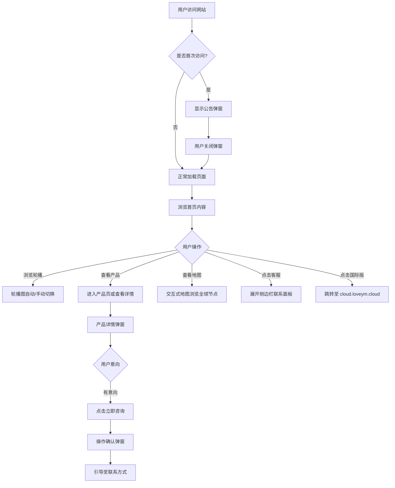

# 语云科技企业官网 - 产品需求文档 (PRD)

## 1. 产品概述

语云科技（Yuyun Technology）面向中国市场的综合性企业官网，融合魔方财务的专业严谨、腾讯云的现代科技感与Cloudflare中国官网的简洁布局。为全球客户提供云计算、网络服务、增值电信等一站式解决方案，展示公司资质、全球业务布局与核心产品服务。

**目标用户**：企业客户、合作伙伴、潜在投资者  
**市场价值**：建立品牌信任度，展示全球化布局与技术实力，促进商务合作与销售转化

## 2. 核心功能

### 2.1 功能模块总览

| 模块 | 描述 | 优先级 |
|------|------|--------|
| 多页面导航系统 | 全站导航 + 汉堡菜单 + 下拉菜单 | P0 |
| 首页核心区 | 轮播图 + 资质展示 + 合作伙伴 + 全球地图 + 产品业务 | P0 |
| 关于我们 | 公司信息 + 地图定位 + 联系方式 + 群聊二维码 | P0 |
| 产品介绍 | 产品/业务卡片网格展示 | P0 |
| 联系我们 | 表单 + 联系信息 + 地图嵌入 | P1 |
| 合作伙伴 | Logo横滚展示 | P1 |
| 弹窗提示系统 | 公告弹窗 + 操作确认弹窗 | P0 |
| 客服侧边栏 | 固定右侧客服面板 | P0 |
| 页脚 | Cloudflare风格黑色页脚 + 备案信息 | P0 |
| 后台管理系统 | 全内容配置管理界面 | P0 |

### 2.2 页面详情

#### 页面一：首页 (index.html)

| 模块名称 | 功能描述 |
|----------|----------|
| **顶部导航栏** | Logo + 导航链接（首页/关于我们/产品介绍/联系我们/合作伙伴）+ 国际版跳转 + 汉堡菜单（移动端）+ 下拉子菜单 |
| **全屏轮播图** | 自动播放(3秒间隔) + 左右切换按钮 + 底部圆点指示器 + CSS3过渡动画 + 后台可配置图片/标题/描述/CTA按钮 |
| **资质展示区** | 卡片式展示"营业执照"与"电子增值电信业务经营许可证"，图片+文字描述，后台可配置 |
| **产品业务展示** | 网格/卡片布局，每项含图标+标题+简述+"了解更多"链接，模仿腾讯云产品矩阵风格 |
| **合作伙伴横滚** | "我们与以下企业/组织携手共进"标题 + 自动循环滚动Logo墙 + 鼠标悬停暂停 |
| **全球分布地图** | 交互式地图标记：中东、欧洲、北京、青岛、莫斯科、圣彼得堡、首尔、新加坡、澳大利亚、纽约、华盛顿、旧金山，点击显示分公司信息弹窗 |
| **右侧客服栏** | 固定悬浮，包含客服图标、联系方式、在线咨询按钮，展开/收起动画 |

#### 页面二：关于我们 (about.html)

| 模块名称 | 功能描述 |
|----------|----------|
| **面包屑导航** | 首页 > 关于我们 |
| **公司简介区** | 公司名称、成立时间、详细介绍文字、企业文化 |
| **联系方式区** | 营销电话(400-800-8541)、官方群聊二维码、邮箱地址 |
| **嵌入式地图** | 定位至公司实际地址，可交互缩放拖拽 |
| **发展历程** | 时间轴展示公司里程碑事件 |

#### 页面三：产品介绍 (products.html)

| 模块名称 | 功能描述 |
|----------|----------|
| **产品分类导航** | 云计算/网络服务/增值电信/安全防护等分类标签 |
| **产品卡片网格** | 每个产品：图标/封面图 + 名称 + 核心功能列表 + "了解更多"/"立即咨询"按钮 |
| **产品详情模态框** | 点击卡片弹出详细说明，包含功能特性、应用场景、技术参数 |

#### 页面四：联系我们 (contact.html)

| 模块名称 | 功能描述 |
|----------|----------|
| **联系表单** | 姓名/电话/邮箱/公司/咨询内容字段 + 表单验证 + 提交反馈 |
| **多渠道联系** | 电话/邮箱/地址/工作时间/社交媒体链接 |
| **地图嵌入** | 公司位置地图 |

#### 页面五：合作伙伴 (partners.html)

| 模块名称 | 功能描述 |
|----------|----------|
| **合作伙伴网格** | 分类展示所有合作伙伴Logo + 简介链接 |
| **合作案例** | 典型合作案例展示 |

#### 页面六：后台管理 (admin/index.html)

| 模块名称 | 功能描述 |
|----------|----------|
| **登录认证** | 管理员账号密码登录 |
| **轮播图管理** | 添加/编辑/删除/排序轮播项 |
| **产品管理** | CRUD产品数据 |
| **合作伙伴管理** | 管理Logo与简介 |
| **公司信息管理** | 编辑联系方式、简介等 |
| **弹窗公告管理** | 配置公告内容、颜色、显示频率 |
| **全局设置** | 页脚电话、备案号、地图标记点等 |

### 2.3 全局组件

| 组件 | 描述 |
|------|------|
| **通知公告弹窗** | 首次访问自动弹出，支持后台配置顶栏颜色/按钮颜色/每日仅显一次 |
| **操作确认弹窗** | 关键操作时触发，模糊背景遮罩，腾讯云风格 |
| **固定客服侧边栏** | 右侧固定，点击展开，含在线咨询入口/电话/工作时间 |
| **全局页脚** | 黑色背景，Logo + 橙色销售电话 + 备案号 + 授权声明 + 国际版链接 |

## 3. 核心流程

## 4. 用户界面设计

### 4.1 设计风格定义

| 设计要素 | 规范 |
|----------|------|
| **主色调** | 专业蓝 #0052D9（魔方财务蓝系） |
| **辅助色** | 活力橙 #FF6B00（腾讯云橙色点缀） |
| **深色背景** | #0D0D0D / #1A1A1A（Cloudflare页脚黑） |
| **背景色** | #F5F7FA（浅灰底）、#FFFFFF（纯白卡片） |
| **文字色** | #1A1A1A（主文本）、#666666（次要文本）、#999999（辅助文本） |
| **强调色** | #00A870（成功绿）、#E34D59（警告红） |
| **字体** | 标题: 思源黑体/Noto Sans SC Bold; 正文: 苹方/PingFang SC / Noto Sans SC Regular; 数字/代码: JetBrains Mono/DIN Alternate |

### 4.2 布局规范

| 元素 | 规范 |
|------|------|
| **最大内容宽度** | 1200px 居中 |
| **导航栏高度** | 64px 固定顶部，滚动时添加阴影 |
| **卡片圆角** | 8px - 12px |
| **间距体系** | 8px基准，使用 8/16/24/32/48/64/96px |
| **阴影层级** | level-1: 0 2px 8px rgba(0,0,0,0.08); level-2: 0 4px 16px rgba(0,0,0,0.12); level-3: 0 8px 32px rgba(0,0,0,0.16) |
| **按钮样式** | 主按钮：蓝底白字 圆角6px 高40px；次要按钮：描边蓝；危险操作：橙色填充 |

### 4.3 动效规范

| 动效类型 | 规格 |
|----------|------|
| **页面过渡** | fadeIn 0.3s ease |
| **轮播切换** | slide 0.5s ease-in-out |
| **悬停效果** | transform translateY(-2px) + shadow增强 0.25s |
| **弹窗出现** | scale(0.95→1) + opacity 0→1, 0.3s ease |
| **侧边栏展开** | translateX 0.3s cubic-bezier(0.4,0,0.2,1) |
| **Logo横滚** | CSS animation infinite linear 30s |

### 4.4 响应式断点

| 断点 | 宽度 | 适配策略 |
|------|------|----------|
| Desktop | ≥1200px | 完整布局 |
| Tablet | 768px - 1199px | 缩小间距，2列网格 |
| Mobile | <768px | 汉堡菜单，单列堆叠 |

## 5. 内容配置清单（后台管理）

### 5.1 可配置内容项

| 配置项 | 字段 | 类型 |
|--------|------|------|
| 轮播图 | image, title, description, ctaText, ctaLink, order | Array |
| 资质证书 | name, image, description, order | Array |
| 产品业务 | icon, name, title, description, features[], link, category | Array |
| 合作伙伴 | logo, name, description, link, order | Array |
| 全球节点 | name, city, lat, lng, description | Array |
| 公司信息 | name, address, phone, email, qrCode, intro | Object |
| 公告弹窗 | title, content, headerColor, buttonColor, showOnceDaily | Object |
| 页脚配置 | phone, icp, policeCode, license, declaration | Object |
| 导航菜单 | label, link, children[] | Array |
