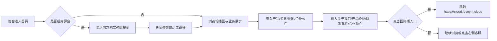
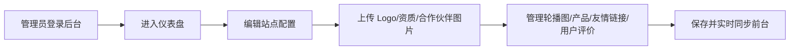

# 语云科技中国企业官网 - 产品需求文档

## 1. 产品概述

语云科技中国企业官网是一个面向国内市场的企业品牌展示与产品营销站点，参考魔方财务、Cloudflare 中国官网、腾讯云官网及霜云（shangyun.net）的视觉风格与交互模式。站点需具备专业、可信、全球化的企业形象，支持后台管理员对 Logo、图片、文案、备案信息、合作伙伴、友情链接、用户评价等内容的灵活配置。

## 2. 核心功能

### 2.1 用户角色

| 角色 | 注册/登录方式 | 核心权限 |
|------|--------------|----------|
| 普通访客 | 无需注册 | 浏览所有前台页面、查看产品与联系方式、触发客服弹窗 |
| 系统管理员 | 后台登录（账号密码） | 配置站点全局信息、页面内容、轮播图、合作伙伴、友情链接、备案信息、用户管理 |

### 2.2 功能模块

1. **首页**
   - 顶部导航 + 汉堡菜单（响应式）
   - 全屏轮播 Banner（魔方/腾讯同款）
   - 核心业务与产品展示（魔方财务同款卡片）
   - 企业资质展示区（营业执照、电子增值服务产业证等）
   - 全球公司分布地图（中东、欧洲、中国北京/青岛、俄罗斯莫斯科/圣彼得堡、韩国首尔、东南亚新加坡、澳大利亚、美国纽约/华盛顿/旧金山等）
   - 合作伙伴横向滚动条（Cloudflare/腾讯同款）
   - 底部页脚
2. **关于我们**
   - 公司名称、地址、介绍
   - 地图（百度/高德/腾讯地图嵌入）
   - 营销电话：400-800-8541
   - 官方群聊入口
3. **公司简介**
   - 企业发展历程、愿景使命、核心团队/荣誉
4. **产品介绍**
   - 产品分类列表、详情卡片、特性说明
5. **联系我们**
   - 联系表单、电话、邮箱、地址、地图
6. **合作伙伴**
   - 合作伙伴 Logo 墙与名称展示
7. **国际版官网**
   - 跳转链接至 https://cloud.loveym.cloud
8. **后台管理**
   - 站点配置（Logo、名称、备案号、ICP、公安网备案、版权信息）
   - 首页轮播图管理
   - 产品介绍管理
   - 合作伙伴管理（图片、名称、链接）
   - 友情链接管理
   - 用户评价/案例管理
   - 资质证书图片管理
   - 管理员账号管理

### 2.3 页面详情

| 页面名称 | 模块名称 | 功能描述 |
|----------|----------|----------|
| 首页 | 顶部导航 | 固定顶部，含 Logo、主导航、右侧客服/联系方式入口、移动端汉堡菜单 |
| 首页 | 轮播图 | 魔方财务/腾讯同款全屏轮播，支持标题、副标题、按钮、背景图配置 |
| 首页 | 魔方同款弹窗 | 页面加载后可配置的公告/营销弹窗，含关闭按钮与再次弹出控制 |
| 首页 | 业务产品展示 | 卡片式布局展示云计算/IDC/财务系统类产品 |
| 首页 | 企业资质 | 展示营业执照、电子增值服务产业证等图片 |
| 首页 | 公司分布地图 | 标注全球节点，中东、欧洲、中国、俄罗斯、韩国、新加坡、澳大利亚、美国等 |
| 首页 | 合作伙伴滚动 | 横向无限滚动 Logo 条，仿 Cloudflare/腾讯云 |
| 首页 | 右侧悬浮客服 | 魔方同款右侧联系方式与客服按钮 |
| 关于我们 | 企业信息 | 公司名称、地址、官方介绍、营销电话、官方群聊 |
| 关于我们 | 地图 | 嵌入百度/高德/腾讯地图 iframe |
| 公司简介 | 企业历程 | 时间轴、荣誉资质、愿景使命 |
| 产品介绍 | 产品列表 | 分类筛选、产品卡片、特性图标 |
| 联系我们 | 联系表单 | 姓名、电话、邮箱、留言、提交反馈 |
| 联系我们 | 联系信息 | 地址、电话、邮箱、地图 |
| 合作伙伴 | 合作伙伴墙 | 图片 + 名称 + 链接网格展示 |
| 国际版 | 跳转页 | 自动跳转或点击跳转至 https://cloud.loveym.cloud |
| 全局 | 页脚 | 黑色背景（Cloudflare 同款），Logo 下方橙色销售电话 400-800-8451，备案号、ICP、公安网备案、版权声明 |
| 后台 | 登录 | 管理员登录页 |
| 后台 | 仪表盘 | 内容统计与快捷入口 |
| 后台 | 站点配置 | Logo、网站名称、备案号、版权等全局配置 |
| 后台 | 内容管理 | 轮播图、产品、合作伙伴、友情链接、资质证书、用户评价增删改查 |
| 后台 | 账号管理 | 修改管理员密码等 |

## 3. 核心流程

### 3.1 访客浏览流程

### 3.2 管理员配置流程

## 4. 用户界面设计

### 4.1 设计风格

- **主色调**：深海蓝 `#0A2540`（Cloudflare 同款深色）+ 科技蓝 `#00A4E4` + 活力橙 `#FF6B00`（销售电话高亮）
- **辅助色**：白色 `#FFFFFF`、浅灰 `#F6F9FC`、深灰 `#1A1A1A`、页脚黑色 `#0D0D0D`
- **按钮样式**：圆角 6-8px，主按钮使用科技蓝渐变，悬停带轻微上移与阴影；危险/强调按钮使用橙色
- **字体**：中文使用 "Noto Sans SC"，英文/数字使用 "Inter" 或系统默认无衬线字体；标题使用较粗字重（600-700），正文 400-500
- **布局**：顶部固定导航 + 全宽区块 + 最大宽度 1280px 的内容容器 + 响应式网格
- **图标**：使用 Lucide React 图标库，统一线性风格
- **弹窗**：魔方/腾讯同款居中模态框，带遮罩、关闭按钮、可配置标题/内容/按钮

### 4.2 页面设计概览

| 页面名称 | 模块名称 | UI 元素 |
|----------|----------|---------|
| 首页 | Hero 轮播 | 全屏背景图、渐变遮罩、大标题、副标题、CTA 按钮、指示器、自动切换 |
| 首页 | 业务产品 | 四列网格卡片、图标、标题、简介、悬停阴影与上移动画 |
| 首页 | 资质展示 | 横向滚动图片条或灯箱卡片，点击放大 |
| 首页 | 全球分布 | 深色地图背景、发光节点标记、区域标签、交互 tooltip |
| 首页 | 合作伙伴 | 无限横向滚动 Logo 墙，灰度转彩色悬停效果 |
| 首页 | 右侧客服 | 固定右侧悬浮按钮，展开显示 QQ/电话/微信/邮箱 |
| 关于我们 | 企业信息 | 两栏布局，左侧图文介绍，右侧联系卡片 |
| 产品介绍 | 产品列表 | 标签筛选 + 三列卡片 + 特性图标 |
| 联系我们 | 联系表单 | 表单输入框、提交按钮、表单验证提示 |
| 后台 | 管理表格 | 表格列表、分页、搜索、新增/编辑/删除操作 |

### 4.3 响应式策略

- **桌面优先**：默认 1280px 容器，适配 1920px、1440px、1024px
- **平板**：≤1024px 时导航折叠为汉堡菜单，网格变为 2 列
- **移动端**：≤768px 时单列布局，轮播高度降低，右侧客服变为底部固定条，地图可缩放
- **触摸优化**：按钮与链接最小点击区域 44×44px，轮播支持滑动切换

## 5. 非功能性需求

- **性能**：首屏加载 ≤3s，图片使用 WebP/懒加载，路由懒加载
- **SEO**：每个页面设置独立 title/description，语义化 HTML
- **可访问性**：支持键盘导航，图片 alt 文本，ARIA 标签
- **安全**：后台登录密码加盐哈希，防止 XSS/CSRF，上传文件类型与大小限制
- **兼容性**：Chrome/Firefox/Safari/Edge 最新两个主版本
