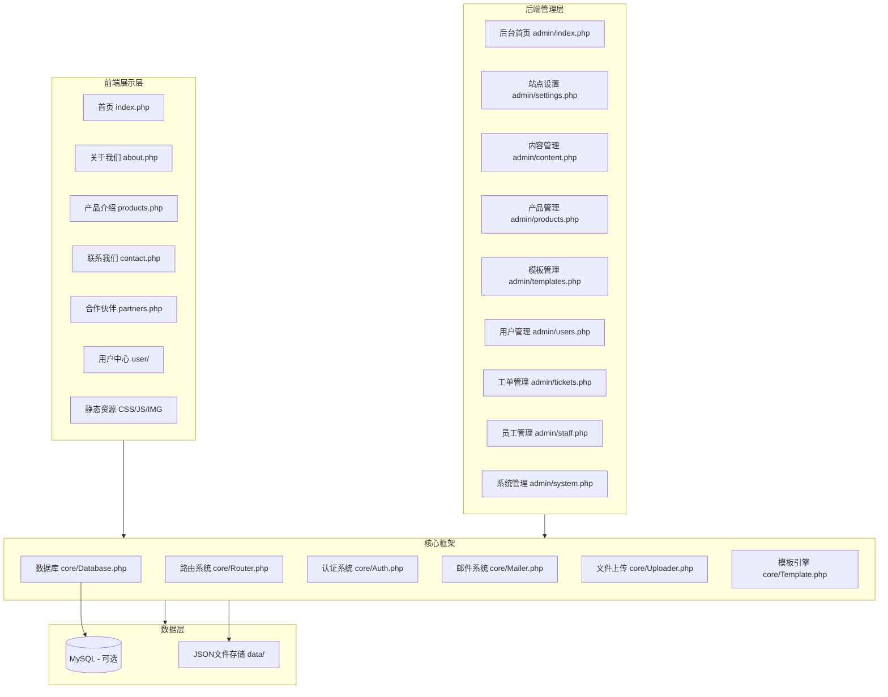
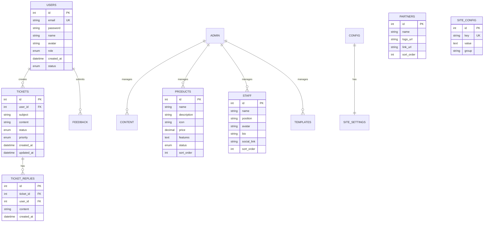

# 语云科技企业官网 - 技术架构文档

## 1. 架构设计



## 2. 技术选型

### 2.1 前端技术
| 技术 | 版本 | 用途 |
|------|------|------|
| HTML5 | - | 页面结构 |
| CSS3 | - | 样式、动画、响应式 |
| JavaScript ES6+ | - | 交互逻辑、AJAX |
| Font Awesome 6 | 6.x | 图标库 |
| Swiper.js | 8.x-11.x | 轮播组件 |
| AOS.js | 2.x | 滚动动画 |
| Google Fonts | - | Noto Sans SC字体 |

### 2.2 后端技术
| 技术 | 版本 | 用途 |
|------|------|------|
| PHP | 7.4+ | 服务端逻辑 |
| PDO | - | 数据库操作(MySQL可选) |
| JSON | - | 文件存储模式 |
| PHPMailer | 6.x | 邮件发送 |
| Session/Cookie | - | 用户会话 |

### 2.3 设计参考
- 视觉风格: Cloudflare深色科技风 + 腾讯云企业蓝 + 魔方财务交互
- 弹窗样式: 魔方财务毛玻璃Modal
- 页脚样式: Cloudflare黑色页脚+橙色强调
- 导航样式: 腾讯云顶部导航+汉堡菜单
- 合作伙伴: Cloudflare无限横滚Logo墙

## 3. 目录结构

```
yuyun-website/
├── index.php                  # 首页
├── about.php                  # 关于我们
├── intro.php                  # 公司简介
├── products.php               # 产品介绍
├── contact.php                # 联系我们
├── partners.php               # 合作伙伴
├── install.php                # 安装程序
│
├── admin/                     # 后台管理
│   ├── index.php              # 后台入口/登录
│   ├── dashboard.php          # 仪表盘
│   ├── settings.php           # 站点设置
│   ├── content.php            # 内容管理
│   ├── products.php           # 产品管理
│   ├── templates.php          # 模板管理
│   ├── users.php              # 用户管理
│   ├── tickets.php            # 工单管理
│   ├── staff.php              # 员工管理
│   └── system.php             # 系统管理
│
├── user/                      # 用户中心
│   ├── login.php              # 登录页
│   ├── register.php           # 注册页
│   ├── dashboard.php          # 用户中心
│   ├── profile.php            # 个人资料
│   ├── tickets.php            # 我的工单
│   ├── feedback.php           # 建议举报
│   └── logout.php             # 退出登录
│
├── api/                       # API接口
│   ├── auth.php               # 认证接口
│   ├── content.php            # 内容接口
│   ├── ticket.php             # 工单接口
│   ├── upload.php             # 上传接口
│   └── template.php           # 模板接口
│
├── core/                      # 核心框架
│   ├── Router.php             # 路由
│   ├── Database.php           # 数据库类
│   ├── Auth.php               # 认证类
│   ├── Mailer.php             # 邮件类
│   ├── Uploader.php           # 上传类
│   ├── Template.php           # 模板引擎
│   └── Functions.php          # 公共函数
│
├── assets/                    # 静态资源
│   ├── css/
│   │   ├── style.css          # 主样式
│   │   ├── admin.css          # 后台样式
│   │   ├── responsive.css     # 响应式
│   │   └── animations.css     # 动画
│   ├── js/
│   │   ├── main.js            # 主脚本
│   │   ├── admin.js           # 后台脚本
│   │   ├── carousel.js        # 轮播
│   │   ├── map.js             # 地图
│   │   └── modal.js           # 弹窗
│   └── img/
│       ├── logo/              # Logo图片
│       ├── banner/            # 轮播图
│       ├── product/           # 产品图片
│       ├── partner/           # 合作伙伴
│       ├── certificate/       # 资质证书
│       └── staff/             # 员工照片
│
├── templates/                 # 模板目录
│   ├── default/               # 默认模板(腾讯云蓝)
│   ├── dark/                  # 深色模板(Cloudflare风)
│   ├── light/                 # 亮色模板(简洁白)
│   └── gradient/              # 渐变模板(现代风)
│
├── data/                      # 数据存储(JSON模式)
│   ├── config.json            # 站点配置
│   ├── content.json           # 内容数据
│   ├── products.json          # 产品数据
│   ├── partners.json          # 合作伙伴
│   ├── staff.json             # 员工数据
│   ├── tickets.json           # 工单数据
│   └── users.json             # 用户数据
│
├── uploads/                   # 上传文件目录
│   ├── images/                # 图片
│   ├── templates/             # 用户上传模板
│   └── patches/              # 补丁文件
│
├── .htaccess                  # URL重写规则
├── config.sample.php          # 配置示例
└── README.md                  # 说明文档
```

## 4. 路由定义

| 路由 | 方法 | 用途 | 权限 |
|------|------|------|------|
| / | GET | 首页 | 公开 |
| /about | GET | 关于我们 | 公开 |
| /products | GET | 产品列表 | 公开 |
| /contact | GET | 联系我们 | 公开 |
| /partners | GET | 合作伙伴 | 公开 |
| /user/login | GET/POST | 用户登录 | 公开 |
| /user/register | GET/POST | 用户注册 | 公开 |
| /user/dashboard | GET | 用户中心 | 已登录 |
| /user/tickets | GET/POST | 工单管理 | 已登录 |
| /admin | GET/POST | 后台登录 | 公开 |
|/admin/dashboard | GET | 仪表盘 | 管理员 |
| /admin/settings | GET/POST | 站点设置 | 管理员 |
| /admin/content | GET/POST | 内容管理 | 管理员 |
| /admin/templates | GET/POST | 模板管理 | 管理员 |
| /admin/users | GET | 用户管理 | 管理员 |
| /admin/tickets | GET/POST | 工单管理 | 管理员 |
| /api/auth/* | POST | 认证API | 公开 |
| /api/content/* | GET/POST | 内容API | 混合 |
| /api/upload | POST | 文件上传 | 已登录 |
| /install | GET/POST | 安装程序 | 首次访问 |

## 5. API定义

### 5.1 认证 API

```php
// POST /api/auth/login
// 请求: { email, password }
// 响应: { code: 200, data: { token, user }, message: "success" }

// POST /api/auth/register
// 请求: { email, password, name }
// 响应: { code: 200, data: { user_id }, message: "注册成功" }

// POST /api/auth/email-code
// 请求: { email }
// 响应: { code: 200, message: "验证码已发送" }

// POST /api/auth/email-login
// 请求: { email, code }
// 响应: { code: 200, data: { token, user } }
```

### 5.2 工单 API

```php
// GET /api/ticket/list
// 响应: { code: 200, data: [{ id, title, status, created_at }] }

// POST /api/ticket/create
// 请求: { subject, content, priority }
// 响应: { code: 200, data: { ticket_id } }

// POST /api/ticket/reply
// 请求: { ticket_id, content }
// 响应: { code: 200, message: "回复成功" }

// POST /api/ticket/close
// 请求: { ticket_id }
// 响应: { code: 200, message: "工单已关闭" }
```

### 5.3 内容 API

```php
// GET /api/content/{type}
// type: banners, partners, products, staff, certificates, links
// 响应: { code: 200, data: [...] }

// POST /api/content/{type}
// 需要管理员权限
// 响应: { code: 200, message: "操作成功" }
```

## 6. 数据模型

### 6.1 ER图



### 6.2 DDL (MySQL)

```sql
-- 用户表
CREATE TABLE `users` (
    `id` INT AUTO_INCREMENT PRIMARY KEY,
    `email` VARCHAR(255) NOT NULL UNIQUE,
    `password` VARCHAR(255),
    `name` VARCHAR(100),
    `avatar` VARCHAR(500),
    `role` ENUM('user','admin') DEFAULT 'user',
    `email_verified` TINYINT(1) DEFAULT 0,
    `status` ENUM('active','banned') DEFAULT 'active',
    `created_at` DATETIME DEFAULT CURRENT_TIMESTAMP,
    `updated_at` DATETIME DEFAULT CURRENT_TIMESTAMP ON UPDATE CURRENT_TIMESTAMP
) ENGINE=InnoDB DEFAULT CHARSET=utf8mb4;

-- 工单表
CREATE TABLE `tickets` (
    `id` INT AUTO_INCREMENT PRIMARY KEY,
    `user_id` INT NOT NULL,
    `subject` VARCHAR(255) NOT NULL,
    `content` TEXT NOT NULL,
    `status` ENUM('open','replying','closed','resolved') DEFAULT 'open',
    `priority` ENUM('low','normal','high','urgent') DEFAULT 'normal',
    `created_at` DATETIME DEFAULT CURRENT_TIMESTAMP,
    `updated_at` DATETIME DEFAULT CURRENT_TIMESTAMP ON UPDATE CURRENT_TIMESTAMP,
    FOREIGN KEY (`user_id`) REFERENCES `users`(`id`)
) ENGINE=InnoDB DEFAULT CHARSET=utf8mb4;

-- 工单回复表
CREATE TABLE `ticket_replies` (
    `id` INT AUTO_INCREMENT PRIMARY KEY,
    `ticket_id` INT NOT NULL,
    `user_id` INT NOT NULL,
    `content` TEXT NOT NULL,
    `is_admin` TINYINT(1) DEFAULT 0,
    `created_at` DATETIME DEFAULT CURRENT_TIMESTAMP,
    FOREIGN KEY (`ticket_id`) REFERENCES `tickets`(`id`),
    FOREIGN KEY (`user_id`) REFERENCES `users`(`id`)
) ENGINE=InnoDB DEFAULT CHARSET=utf8mb4;

-- 产品表
CREATE TABLE `products` (
    `id` INT AUTO_INCREMENT PRIMARY KEY,
    `name` VARCHAR(255) NOT NULL,
    `description` TEXT,
    `icon` VARCHAR(100),
    `price` DECIMAL(10,2),
    `features` JSON,
    `status` ENUM('active','inactive') DEFAULT 'active',
    `sort_order` INT DEFAULT 0,
    `created_at` DATETIME DEFAULT CURRENT_TIMESTAMP
) ENGINE=InnoDB DEFAULT CHARSET=utf8mb4;

-- 合作伙伴表
CREATE TABLE `partners` (
    `id` INT AUTO_INCREMENT PRIMARY KEY,
    `name` VARCHAR(255) NOT NULL,
    `logo_url` VARCHAR(500) NOT NULL,
    `link_url` VARCHAR(500),
    `sort_order` INT DEFAULT 0,
    `status` TINYINT(1) DEFAULT 1
) ENGINE=InnoDB DEFAULT CHARSET=utf8mb4;

-- 员工表
CREATE TABLE `staff` (
    `id` INT AUTO_INCREMENT PRIMARY KEY,
    `name` VARCHAR(100) NOT NULL,
    `position` VARCHAR(100),
    `avatar` VARCHAR(500),
    `bio` TEXT,
    `social_link` VARCHAR(500),
    `sort_order` INT DEFAULT 0,
    `status` TINYINT(1) DEFAULT 1
) ENGINE=InnoDB DEFAULT CHARSET=utf8mb4;

-- 站点配置表
CREATE TABLE `site_config` (
    `id` INT AUTO_INCREMENT PRIMARY KEY,
    `config_key` VARCHAR(100) NOT NULL UNIQUE,
    `config_value` TEXT,
    `config_group` VARCHAR(50) DEFAULT 'general',
    `created_at` DATETIME DEFAULT CURRENT_TIMESTAMP,
    `updated_at` DATETIME DEFAULT CURRENT_TIMESTAMP ON UPDATE CURRENT_TIMESTAMP
) ENGINE=InnoDB DEFAULT CHARSET=utf8mb4;

-- 反馈建议表
CREATE TABLE `feedback` (
    `id` INT AUTO_INCREMENT PRIMARY KEY,
    `user_id` INT,
    `type` ENUM('suggestion','report') NOT NULL,
    `title` VARCHAR(255),
    `content` TEXT NOT NULL,
    `status` ENUM('pending','processing','resolved') DEFAULT 'pending',
    `created_at` DATETIME DEFAULT CURRENT_TIMESTAMP,
    FOREIGN KEY (`user_id`) REFERENCES `users`(`id`)
) ENGINE=InnoDB DEFAULT CHARSET=utf8mb4;
```

## 7. 安全设计
- 密码: password_hash(PHP默认bcrypt)
- Session: 安全Session配置 + CSRF Token
- SQL: PDO预处理语句防注入
- XSS: 输出过滤 + CSP头
- 文件上传: 类型白名单 + 大小限制 + 重命名
- 登录限制: 失败次数限制 + 验证码
- 管理后台: IP白名单(可选) + 操作日志

## 8. 性能优化
- 静态资源缓存策略
- 图片压缩 + 懒加载
- CSS/JS压缩(生产环境)
- JSON数据文件缓存
- Gzip压缩(服务器配置)
- CDN加速(可选)
