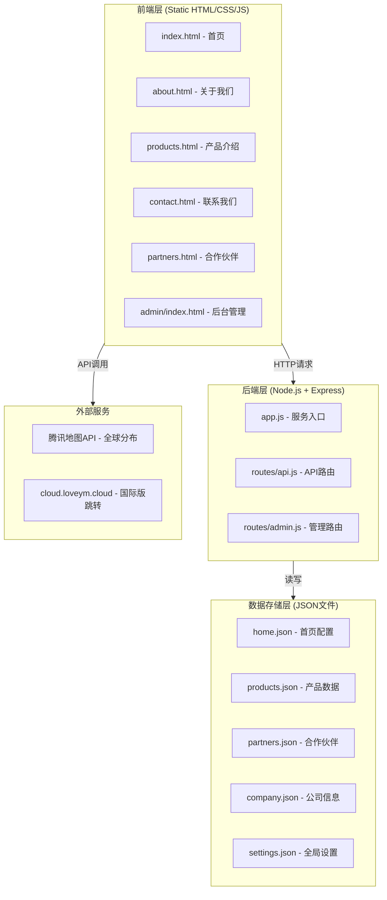

# 语云科技企业官网 - 技术架构文档

## 1. 架构设计



## 2. 技术栈选型

| 层级 | 技术选型 | 版本 | 说明 |
|------|----------|------|------|
| **前端HTML** | HTML5 | - | 语义化标签 |
| **前端CSS** | CSS3 | - | Flexbox/Grid布局、CSS变量、CSS动画 |
| **前端JS** | Vanilla JavaScript ES6+ | - | 无框架依赖，轻量高效 |
| **后端运行时** | Node.js | ≥18.x | LTS版本 |
| **后端框架** | Express.js | ^4.18.x | 轻量级Web框架 |
| **数据存储** | JSON文件 | - | 无需MySQL，fs模块读写 |
| **地图服务** | 腾讯地图JavaScript API GL | - | 全球节点标注 |
| **字体** | Google Fonts + 本地 fallback | Noto Sans SC | 中英文混排优化 |
| **图标** | 内联SVG + CSS Icon | - | 无外部图标库依赖 |

## 3. 项目目录结构

```
yuyun-tech/
├── server/                     # 后端服务代码
│   ├── app.js                  # Express主入口
│   ├── package.json            # 后端依赖配置
│   ├── routes/
│   │   ├── api.js              # 前端读取API路由
│   │   └── admin.js            # 后台管理API路由
│   └── data/
│       ├── home.json           # 首页配置（轮播图、资质）
│       ├── products.json       # 产品业务数据
│       ├── partners.json       # 合作伙伴数据
│       ├── company.json        # 公司信息与联系方式
│       └── settings.json       # 全局设置（公告、页脚、导航）
│
├── public/                     # 前端静态文件根目录
│   ├── index.html              # 首页
│   ├── about.html              # 关于我们
│   ├── products.html           # 产品介绍
│   ├── contact.html            # 联系我们
│   ├── partners.html           # 合作伙伴
│   │
│   └── assets/
│       ├── css/
│       │   ├── style.css       # 全局样式与变量
│       │   ├── components.css  # 组件样式（弹窗、侧边栏、卡片）
│       │   ├── pages.css       # 各页面专属样式
│       │   └── responsive.css  # 响应式适配
│       │
│       ├── js/
│       │   ├── app.js          # 全局脚本（导航、通用函数）
│       │   ├── carousel.js     # 轮播图组件
│       │   ├── modal.js        # 弹窗系统
│       │   ├── sidebar.js      # 客服侧边栏
│       │   ├── map.js          # 地图初始化与交互
│       │   ├── partners.js     # 合作伙伴横滚
│       │   └── admin.js        # 后台管理交互逻辑
│       │
│       └── images/
│           ├── logo.svg        # 语云科技Logo
│           ├── slider/         # 轮播图图片
│           ├── certs/          # 资质证书图片
│           ├── products/       # 产品图标/封面
│           ├── partners/       # 合作伙伴Logo
│           └── qrcode.png      # 官方群聊二维码
│
├── admin/                      # 后台管理界面
│   ├── index.html              # 管理后台主页
│   └── assets/
│       ├── css/
│       │   └── admin.css       # 后台管理样式
│       └── js/
│           └── admin.js        # 后台管理交互
│
└── README.md                   # 项目说明文档
```

## 4. 路由定义

### 4.1 前端页面路由（静态）

| URL路径 | 页面 | 说明 |
|---------|------|------|
| `/` 或 `/index.html` | 首页 | 主入口 |
| `/about.html` | 关于我们 | 公司介绍 |
| `/products.html` | 产品介绍 | 产品/业务展示 |
| `/contact.html` | 联系我们 | 联系表单与信息 |
| `/partners.html` | 合作伙伴 | 合作生态 |
| `/admin/` | 后台管理 | 内容管理后台 |

### 4.2 后端API路由

#### 数据读取API（公开）

| 方法 | 路径 | 描述 | 返回示例 |
|------|------|------|----------|
| GET | `/api/home` | 获取首页全部配置 | `{ carousel: [...], certs: [...], nodes: [...] }` |
| GET | `/api/products` | 获取产品列表 | `{ categories: [...], products: [...] }` |
| GET | `/api/partners` | 获取合作伙伴 | `{ partners: [...] }` |
| GET | `/api/company` | 获取公司信息 | `{ name, address, phone, ... }` |
| GET | `/api/settings` | 获取全局设置 | `{ announcement, footer, nav, ... }` |

#### 数据管理API（需鉴权）

| 方法 | 路径 | 描述 | 请求体 |
|------|------|------|--------|
| POST | `/api/admin/login` | 管理员登录 | `{ username, password }` |
| PUT | `/api/admin/home/carousel` | 更新轮播图配置 | `{ carousel: [...] }` |
| PUT | `/api/admin/products` | 更新产品数据 | `{ products: [...] }` |
| PUT | `/api/admin/partners` | 更新合作伙伴 | `{ partners: [...] }` |
| PUT | `/api/admin/company` | 更新公司信息 | `{ company: {...} }` |
| PUT | `/api/admin/settings` | 更新全局设置 | `{ settings: {...} }` |
| POST | `/api/upload` | 图片上传 | multipart/form-data |

## 5. API详细定义

### 5.1 首页配置响应结构

```json
{
  "carousel": [
    {
      "id": "string",
      "image": "url",
      "title": "string",
      "description": "string",
      "ctaText": "string",
      "ctaLink": "string",
      "order": 0,
      "enabled": true
    }
  ],
  "certs": [
    {
      "id": "string",
      "name": "营业执照",
      "image": "url",
      "description": "string"
    }
  ],
  "globalNodes": [
    {
      "id": "string",
      "city": "北京",
      "country": "中国",
      "lat": 39.9042,
      "lng": 116.4074,
      "name": "语云科技北京总部",
      "description": "string"
    }
  ]
}
```

### 5.2 产品数据响应结构

```json
{
  "categories": ["云计算", "网络服务", "安全防护", "增值电信"],
  "products": [
    {
      "id": "string",
      "category": "云计算",
      "icon": "icon-name or url",
      "name": "弹性云服务器",
      "title": "高性能可扩展计算服务",
      "description": "string",
      "features": ["安全可靠", "弹性伸缩", "快速部署"],
      "link": "url",
      "order": 0,
      "enabled": true
    }
  ]
}
```

### 5.3 公司信息响应结构

```json
{
  "name": "语云科技美国有限公司",
  "nameCN": "语云科技",
  "address": {
    "full": "string",
    "city": "string",
    "province": "string"
  },
  "phone": "400-800-8541",
  "salesPhone": "400-800-8541",
  "email": "contact@loveym.cloud",
  "qrCodeImage": "url",
  "intro": "string",
  "founded": "2019",
  "employees": "100+"
}
```

### 5.4 全局设置响应结构

```json
{
  "announcement": {
    "enabled": true,
    "title": "欢迎使用语云科技",
    "content": "string",
    "headerColor": "#0052D9",
    "buttonColor": "#FF6B00",
    "showOnceDaily": true
  },
  "footer": {
    "salesPhone": "400-800-8541",
    "icp": "备案号",
    "icpUrl": "https://beian.miit.gov.cn/",
    "policeCode": "公安备案号",
    "license": "增值电信业务经营许可证",
    "declaration": "语云科技®等是我们（语云科技美国有限公司）在中国的注册授权"
  },
  "internationalUrl": "https://cloud.loveym.cloud",
  "navMenu": [...]
}
```

## 6. 后端核心实现要点

### 6.1 Express服务器配置

- 监听端口：3000（可通过环境变量 PORT 配置）
- 静态文件中间件：托管 `public/` 和 `admin/` 目录
- JSON解析：内置 express.json() 解析请求体
- CORS：允许同源及开发环境跨域
- 文件上传：使用 multer 中间件处理图片上传到 `public/assets/images/`

### 6.2 JSON文件读写工具

```javascript
// 核心读写模式（非阻塞异步）
const fs = require('fs').promises;
const path = require('path');

async function readJSON(filename) {
  const filePath = path.join(__dirname, 'data', filename);
  const data = await fs.readFile(filePath, 'utf-8');
  return JSON.parse(data);
}

async function writeJSON(filename, data) {
  const filePath = path.join(__dirname, 'data', filename);
  await fs.writeFile(filePath, JSON.stringify(data, null, 2), 'utf-8');
}
```

### 6.3 管理员鉴权

- 使用简单 token 机制（JWT或session-based可选简化版）
- 登录凭证存储在 `data/auth.json`
- API请求通过 Authorization header 或 query token 验证
- Token有效期：24小时

## 7. 前端架构要点

### 7.1 CSS变量系统

```css
:root {
  --color-primary: #0052D9;
  --color-primary-light: #3385FF;
  --color-primary-dark: #003DA8;
  --color-accent: #FF6B00;
  --color-accent-light: #FF8C33;
  --color-dark: #0D0D0D;
  --color-dark-secondary: #1A1A1A;
  --color-bg: #F5F7FA;
  --color-white: #FFFFFF;
  --color-text: #1A1A1A;
  --color-text-secondary: #666666;
  --color-text-muted: #999999;
  --color-border: #E5E5E5;
  --color-success: #00A870;
  --color-danger: #E34D59;

  --font-display: 'Noto Sans SC', 'PingFang SC', sans-serif;
  --font-body: 'Noto Sans SC', 'PingFang SC', -apple-system, sans-serif;
  --font-mono: 'JetBrains Mono', 'DIN Alternate', monospace;

  --radius-sm: 4px;
  --radius-md: 8px;
  --radius-lg: 12px;
  --shadow-sm: 0 2px 8px rgba(0,0,0,0.08);
  --shadow-md: 0 4px 16px rgba(0,0,0,0.12);
  --shadow-lg: 0 8px 32px rgba(0,0,0,0.16);

  --nav-height: 64px;
  --max-width: 1200px;
  --transition: 0.25s ease;
}
```

### 7.2 组件化JavaScript架构

每个功能模块独立为JS文件，通过DOMContentLoaded事件初始化：
- `app.js`: 导航栏（含汉堡菜单）、页面通用功能、API数据获取
- `carousel.js`: 轮播图实例类
- `modal.js`: 弹窗工厂函数
- `sidebar.js`: 客服侧边栏状态管理
- `map.js`: 地图初始化与标记点渲染
- `partners.js`: Logo横滚动画控制

### 7.3 地图集成方案

- 使用腾讯地图 JavaScript API GL
- 通过后台JSON数据动态创建标记点
- 自定义标记点样式（蓝色脉冲动画圆点）
- 点击标记显示InfoWindow（含分公司名称和简介）
- 支持地图缩放、拖拽、卫星/地图切换

## 8. 性能与安全考虑

### 8.1 性能优化

- 图片懒加载（loading="lazy" + IntersectionObserver）
- CSS/JS文件压缩（生产环境）
- 静态资源缓存策略（Cache-Control头）
- 字体预加载（preload关键字体）
- 轮播图预加载首张+延迟加载后续

### 8.2 安全措施

- XSS防护：输出转义、CSP头设置
- CSRF保护：管理API使用简单token校验
- 文件上传限制：类型白名单、大小限制（2MB）
- 敏感接口速率限制
- 隐藏错误详情（生产环境返回通用错误）
