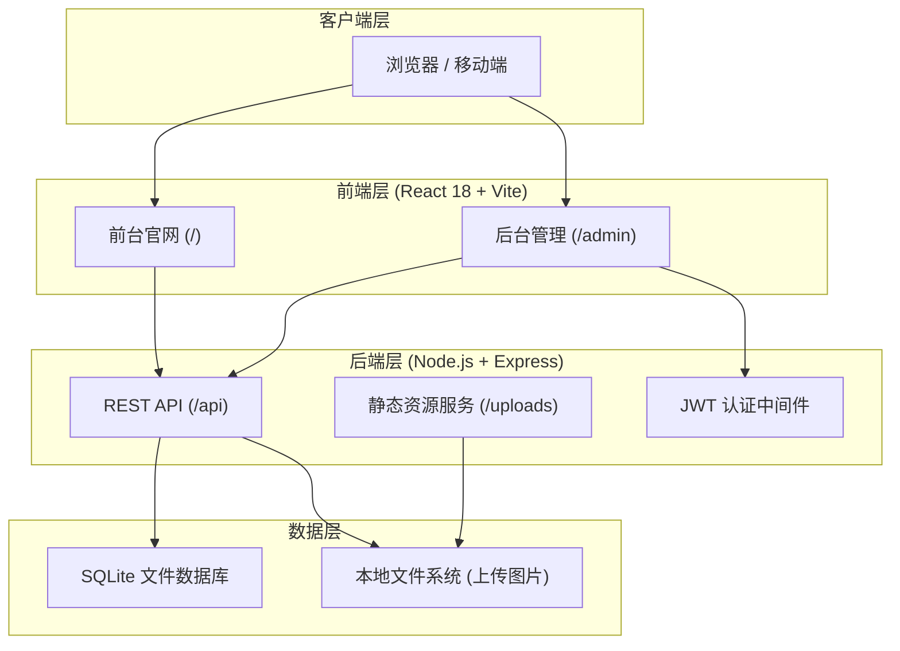
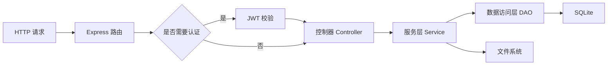
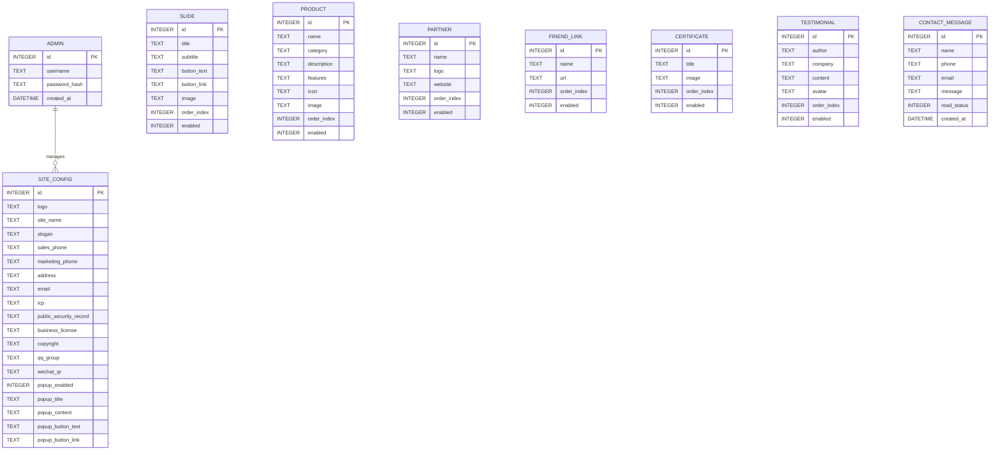

# 语云科技中国企业官网 - 技术架构文档

## 1. 架构设计



## 2. 技术选型

- **前端框架**：React 18 + TypeScript
- **构建工具**：Vite 5
- **样式方案**：Tailwind CSS 3 + 自定义 CSS 变量
- **路由**：React Router 6
- **图标**：Lucide React
- **动画**：Framer Motion
- **地图**：静态 SVG 世界地图（减少外部依赖）+ 发光节点标注
- **后端框架**：Node.js + Express 4
- **数据库**：SQLite 3（无需 MySQL，轻量部署）
- **认证**：JWT（jsonwebtoken）+ bcryptjs 密码哈希
- **文件上传**：Multer
- **HTTP 客户端**：Axios

## 3. 路由定义

### 3.1 前台路由

| 路由 | 用途 |
|------|------|
| / | 首页 |
| /about | 关于我们 |
| /company | 公司简介 |
| /products | 产品介绍 |
| /contact | 联系我们 |
| /partners | 合作伙伴 |
| /global | 国际版官网（跳转页） |

### 3.2 后台路由

| 路由 | 用途 |
|------|------|
| /admin/login | 管理员登录 |
| /admin | 后台仪表盘（登录后） |
| /admin/settings | 站点配置 |
| /admin/slides | 轮播图管理 |
| /admin/products | 产品管理 |
| /admin/partners | 合作伙伴管理 |
| /admin/links | 友情链接管理 |
| /admin/certificates | 资质证书管理 |
| /admin/testimonials | 用户评价管理 |
| /admin/account | 账号管理 |

### 3.3 API 路由

| 路由 | 方法 | 用途 |
|------|------|------|
| /api/auth/login | POST | 管理员登录 |
| /api/auth/me | GET | 获取当前登录管理员 |
| /api/site | GET | 获取站点全局配置 |
| /api/site | PUT | 更新站点全局配置（需登录） |
| /api/slides | GET/POST/PUT/DELETE | 轮播图 CRUD |
| /api/products | GET/POST/PUT/DELETE | 产品 CRUD |
| /api/partners | GET/POST/PUT/DELETE | 合作伙伴 CRUD |
| /api/links | GET/POST/PUT/DELETE | 友情链接 CRUD |
| /api/certificates | GET/POST/PUT/DELETE | 资质证书 CRUD |
| /api/testimonials | GET/POST/PUT/DELETE | 用户评价 CRUD |
| /api/upload | POST | 图片上传 |
| /api/contact | POST | 提交联系表单 |

## 4. API 定义

### 4.1 认证

```typescript
// POST /api/auth/login
interface LoginRequest {
  username: string;
  password: string;
}

interface LoginResponse {
  token: string;
  admin: {
    id: number;
    username: string;
  };
}
```

### 4.2 站点配置

```typescript
interface SiteConfig {
  id: number;
  logo: string;
  siteName: string;
  slogan: string;
  salesPhone: string;
  marketingPhone: string;
  address: string;
  email: string;
  icp: string;
  publicSecurityRecord: string;
  businessLicense: string;
  copyright: string;
  qqGroup: string;
  wechatQr: string;
  popupEnabled: boolean;
  popupTitle: string;
  popupContent: string;
  popupButtonText: string;
  popupButtonLink: string;
}
```

### 4.3 轮播图

```typescript
interface Slide {
  id: number;
  title: string;
  subtitle: string;
  buttonText: string;
  buttonLink: string;
  image: string;
  orderIndex: number;
  enabled: boolean;
}
```

### 4.4 产品

```typescript
interface Product {
  id: number;
  name: string;
  category: string;
  description: string;
  features: string[]; // JSON 数组
  icon: string;
  image: string;
  orderIndex: number;
  enabled: boolean;
}
```

### 4.5 合作伙伴

```typescript
interface Partner {
  id: number;
  name: string;
  logo: string;
  website: string;
  orderIndex: number;
  enabled: boolean;
}
```

### 4.6 友情链接

```typescript
interface FriendLink {
  id: number;
  name: string;
  url: string;
  orderIndex: number;
  enabled: boolean;
}
```

### 4.7 资质证书

```typescript
interface Certificate {
  id: number;
  title: string;
  image: string;
  orderIndex: number;
  enabled: boolean;
}
```

### 4.8 用户评价

```typescript
interface Testimonial {
  id: number;
  author: string;
  company: string;
  content: string;
  avatar: string;
  orderIndex: number;
  enabled: boolean;
}
```

### 4.9 联系表单

```typescript
interface ContactRequest {
  name: string;
  phone: string;
  email: string;
  message: string;
}
```

## 5. 服务端架构



## 6. 数据模型

### 6.1 ER 图



### 6.2 数据定义语言

```sql
-- 管理员表
CREATE TABLE IF NOT EXISTS admin (
  id INTEGER PRIMARY KEY AUTOINCREMENT,
  username TEXT UNIQUE NOT NULL,
  password_hash TEXT NOT NULL,
  created_at DATETIME DEFAULT CURRENT_TIMESTAMP
);

-- 站点配置表（单条记录）
CREATE TABLE IF NOT EXISTS site_config (
  id INTEGER PRIMARY KEY CHECK (id = 1),
  logo TEXT DEFAULT '',
  site_name TEXT DEFAULT '语云科技',
  slogan TEXT DEFAULT '全球领先的云服务与数字化解决方案提供商',
  sales_phone TEXT DEFAULT '400-800-8451',
  marketing_phone TEXT DEFAULT '400-800-8541',
  address TEXT DEFAULT '中国北京市朝阳区xxx路xxx号',
  email TEXT DEFAULT 'contact@yuyun.com',
  icp TEXT DEFAULT '京ICP备XXXXXXXX号',
  public_security_record TEXT DEFAULT '京公网安备XXXXXXXXXXX号',
  business_license TEXT DEFAULT '',
  copyright TEXT DEFAULT '语云科技® 是语云科技美国有限公司在中国的注册授权',
  qq_group TEXT DEFAULT '',
  wechat_qr TEXT DEFAULT '',
  popup_enabled INTEGER DEFAULT 1,
  popup_title TEXT DEFAULT '欢迎访问语云科技',
  popup_content TEXT DEFAULT '我们提供全球领先的云服务与解决方案，立即咨询获取专属优惠。',
  popup_button_text TEXT DEFAULT '立即咨询',
  popup_button_link TEXT DEFAULT '/contact'
);

-- 轮播图表
CREATE TABLE IF NOT EXISTS slides (
  id INTEGER PRIMARY KEY AUTOINCREMENT,
  title TEXT NOT NULL,
  subtitle TEXT DEFAULT '',
  button_text TEXT DEFAULT '',
  button_link TEXT DEFAULT '',
  image TEXT DEFAULT '',
  order_index INTEGER DEFAULT 0,
  enabled INTEGER DEFAULT 1
);

-- 产品表
CREATE TABLE IF NOT EXISTS products (
  id INTEGER PRIMARY KEY AUTOINCREMENT,
  name TEXT NOT NULL,
  category TEXT DEFAULT '',
  description TEXT DEFAULT '',
  features TEXT DEFAULT '[]',
  icon TEXT DEFAULT '',
  image TEXT DEFAULT '',
  order_index INTEGER DEFAULT 0,
  enabled INTEGER DEFAULT 1
);

-- 合作伙伴表
CREATE TABLE IF NOT EXISTS partners (
  id INTEGER PRIMARY KEY AUTOINCREMENT,
  name TEXT NOT NULL,
  logo TEXT DEFAULT '',
  website TEXT DEFAULT '',
  order_index INTEGER DEFAULT 0,
  enabled INTEGER DEFAULT 1
);

-- 友情链接表
CREATE TABLE IF NOT EXISTS friend_links (
  id INTEGER PRIMARY KEY AUTOINCREMENT,
  name TEXT NOT NULL,
  url TEXT NOT NULL,
  order_index INTEGER DEFAULT 0,
  enabled INTEGER DEFAULT 1
);

-- 资质证书表
CREATE TABLE IF NOT EXISTS certificates (
  id INTEGER PRIMARY KEY AUTOINCREMENT,
  title TEXT NOT NULL,
  image TEXT DEFAULT '',
  order_index INTEGER DEFAULT 0,
  enabled INTEGER DEFAULT 1
);

-- 用户评价表
CREATE TABLE IF NOT EXISTS testimonials (
  id INTEGER PRIMARY KEY AUTOINCREMENT,
  author TEXT NOT NULL,
  company TEXT DEFAULT '',
  content TEXT NOT NULL,
  avatar TEXT DEFAULT '',
  order_index INTEGER DEFAULT 0,
  enabled INTEGER DEFAULT 1
);

-- 联系留言表
CREATE TABLE IF NOT EXISTS contact_messages (
  id INTEGER PRIMARY KEY AUTOINCREMENT,
  name TEXT NOT NULL,
  phone TEXT DEFAULT '',
  email TEXT DEFAULT '',
  message TEXT NOT NULL,
  read_status INTEGER DEFAULT 0,
  created_at DATETIME DEFAULT CURRENT_TIMESTAMP
);

-- 初始化默认管理员（密码：admin123，生产环境必须修改）
INSERT OR IGNORE INTO admin (id, username, password_hash)
VALUES (1, 'admin', '$2a$10$92IXUNpkjO0rOQ5byMi.Ye4oKoEa3Ro9llC/.og/at2.uheWG/igi');

-- 初始化站点配置
INSERT OR IGNORE INTO site_config (id) VALUES (1);
```

## 7. 项目目录结构

```
yuyun-website/
├── package.json
├── vite.config.ts
├── tailwind.config.js
├── tsconfig.json
├── index.html
├── public/
│   └── uploads/              # 上传文件目录
├── server/
│   ├── index.js              # Express 入口
│   ├── db.js                 # SQLite 连接与初始化
│   ├── middleware/
│   │   ├── auth.js           # JWT 认证
│   │   └── upload.js         # Multer 上传配置
│   └── routes/
│       ├── auth.js
│       ├── site.js
│       ├── slides.js
│       ├── products.js
│       ├── partners.js
│       ├── links.js
│       ├── certificates.js
│       ├── testimonials.js
│       ├── upload.js
│       └── contact.js
├── src/
│   ├── main.tsx
│   ├── App.tsx
│   ├── index.css
│   ├── api/
│   │   └── index.ts
│   ├── components/
│   │   ├── Navbar.tsx
│   │   ├── Footer.tsx
│   │   ├── HeroSlider.tsx
│   │   ├── Popup.tsx
│   │   ├── ServiceCard.tsx
│   │   ├── PartnerMarquee.tsx
│   │   ├── WorldMap.tsx
│   │   ├── ContactFloat.tsx
│   │   ├── CertificateShowcase.tsx
│   │   └── AdminLayout.tsx
│   ├── pages/
│   │   ├── Home.tsx
│   │   ├── About.tsx
│   │   ├── Company.tsx
│   │   ├── Products.tsx
│   │   ├── Contact.tsx
│   │   ├── Partners.tsx
│   │   ├── GlobalRedirect.tsx
│   │   ├── AdminLogin.tsx
│   │   └── admin/
│   │       ├── Dashboard.tsx
│   │       ├── Settings.tsx
│   │       ├── Slides.tsx
│   │       ├── Products.tsx
│   │       ├── Partners.tsx
│   │       ├── Links.tsx
│   │       ├── Certificates.tsx
│   │       └── Testimonials.tsx
│   ├── hooks/
│   │   └── useSiteConfig.ts
│   └── types/
│       └── index.ts
```

## 8. 部署说明

- 开发环境：运行 `npm run dev` 启动 Vite 开发服务器，同时 `npm run server` 启动后端 API
- 生产构建：运行 `npm run build` 生成静态文件，Express 同时托管 `dist/` 目录与 `/api`
- 数据库：首次启动自动创建 SQLite 文件并初始化默认管理员账号
- 图片上传：上传文件保存在 `public/uploads/`，通过 `/uploads/filename` 访问
